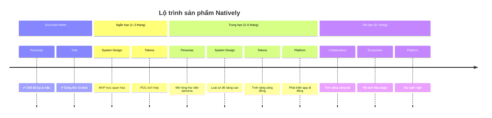

# [Tài trợ bởi Recall AI — API ghi màn hình desktop](https://docs.recall.ai/docs/desktop-sdk?utm_source=github&utm_medium=sponsorship&utm_campaign=evinjohnn-natively-ai-assistant)

Nếu bạn cần API ghi màn hình desktop có máy chủ, hãy xem [Recall.ai](https://docs.recall.ai/docs/desktop-sdk?utm_source=github&utm_medium=sponsorship&utm_campaign=evinjohnn-natively-ai-assistant) — API ghi Zoom, Google Meet, Microsoft Teams, họp trực tiếp và nhiều hơn nữa.

<div align="center">
  

# Natively — Trợ lý AI phỏng vấn & họp mã nguồn mở, miễn phí

**Giải pháp thay thế miễn phí tốt nhất cho Cluely, Final Round AI, LockedIn AI và Interview Coder.**
<br/>
**Giao diện giống Cluely. Nhiều tính năng hơn. 0 đô-la. Mã nguồn mở. Không rò rỉ dữ liệu.**
<br/>

<a href="#" style="pointer-events: none; cursor: default; color: inherit; text-decoration: none;" title="#1 Cluely clone · Free Cluely alternative · Open-source interview copilot · Free Interview Coder alternative · AI coding interview assistant · LeetCode AI solver · HackerRank AI cheat · Final Round AI free alternative · LockedIn AI alternative · Parakeet AI open source · Undetectable interview AI · Stealth mode interview copilot.Cluely clone · Cluely alternative · Free Cluely · Cluely free version · open source Cluely ·
    Final Round AI clone · Final Round AI alternative · Free Final Round AI · Final Round AI free version ·
    Interview Coder clone · Interview Coder alternative · Free Interview Coder · open source Interview Coder ·
    Parakeet AI clone · Parakeet AI alternative · Free Parakeet AI ·
    Wonsulting AI clone · Wonsulting alternative · Free Wonsulting AI ·
    Metaview clone · Metaview alternative · Free Metaview ·
    Sensei AI clone · Sensei AI alternative · interview copilot ·
    Hirevue AI cheat · Hirevue assistant · Hirevue helper ·
    AI interview assistant · AI interview copilot · AI interview helper · interview cheating tool · interview AI ·
    live coding assistant · real-time coding help · screen overlay AI · invisible AI assistant ·
    coding interview cheat sheet · leetcode helper AI · system design AI assistant ·
    Claude Code alternative · Claude Code clone · free Claude Code ·
    Gemini 3.5 assistant · Gemini 3.5 Pro coding · Google Gemini interview tool ·
    Agent Claw alternative · Agent Claw clone · free Agent Claw ·
    Molt Bot clone · Molt Bot alternative · free Molt Bot ·
    Antigravity AI clone · Antigravity alternative ·
    Devin AI alternative · open source Devin · free Devin AI ·
    Cursor AI alternative · Cursor clone · free Cursor AI ·
    GitHub Copilot alternative · free GitHub Copilot · open source Copilot ·
    Tabnine alternative · free Tabnine · Tabnine clone ·
    Codeium alternative · free Codeium ·
    agentic coding assistant · AI pair programmer · AI coding copilot ·
    real-time interview AI · live interview assistant · hidden interview tool ·
    open source interview copilot · free interview AI tool · best interview AI 2026"></a>

<br/>

[](LICENSE)
[](https://github.com/Natively-AI-assistant/natively-cluely-ai-assistant/releases)
[](https://github.com/Natively-AI-assistant/natively-cluely-ai-assistant/releases)

[](https://github.com/Natively-AI-assistant/natively-cluely-ai-assistant)

[](https://x.com/i/communities/2031398735515693507)

> **Đối thủ tính phí $20–$149/tháng, lưu dữ liệu trên máy chủ của họ, và một nền tảng đã làm lộ thông tin 83.000 người dùng.** Natively: $0, chạy cục bộ, chưa từng rò rỉ dữ liệu. Khóa API của bạn, mô hình của bạn, máy của bạn.

<p align="center">
  <a href="https://natively.software">
    
  </a>
</p>

<p align="center">
  <a href="https://github.com/Natively-AI-assistant/natively-cluely-ai-assistant/releases/latest">
    
  </a>
  <a href="https://github.com/Natively-AI-assistant/natively-cluely-ai-assistant/releases/latest">
    
  </a>
</p>

<small>Yêu cầu macOS 12+ (Apple Silicon & Intel) hoặc Windows 10/11</small>

<br/>

**<span style="color: #ef4444">👥 9.000+ người dùng</span>** &nbsp;·&nbsp; **<span style="color: #f97316">🔥 700+ DAU</span>** &nbsp;·&nbsp; **<span style="color: #22c55e">💸 $0 so với đối thủ $149/tháng</span>** &nbsp;·&nbsp; **<span style="color: #3b82f6">⚡ Độ trễ &lt;500ms</span>** &nbsp;·&nbsp; **<span style="color: #a855f7">🛡️ 0 vụ rò rỉ dữ liệu</span>**

</div>

---

<a id="the-free-open-source-cluely-clone"></a>
## Bản sao Cluely mã nguồn mở, miễn phí

Natively bắt đầu là bản tái hiện giao diện Cluely rất sát — rồi phát triển tiếp. Đã dùng Cluely thì bạn đã biết cách dùng Natively. Cùng lớp phủ, cùng quy trình, cùng phím tắt. Khác ở chỗ: miễn phí, mã nguồn mở, chạy cục bộ, hỗ trợ mọi LLM, và chưa từng làm lộ dữ liệu người dùng.

> Đang tìm **thay thế Cluely miễn phí**? **Bản clone Cluely mã nguồn mở**? Bạn đã tìm đúng chỗ.

---

<a id="what-users-are-saying"></a>
## Người dùng nói gì

> "Phần mềm tuyệt vời, hãy tiếp tục phát triển! Đúng thứ tôi cần. Tôi dùng bản mã nguồn mở trước, vì chạy quá tốt nên đã mua bản premium trọn đời."  
> — **Oskar Krzak** (⭐⭐⭐⭐⭐ qua Gumroad)

> "Natively nhanh hơn Cluely rất nhiều về thời gian phản hồi và phân tích màn hình. Độ trễ gần như không có."  
> — **Người dùng Premium**

> "Cảm ơn team! Natively giúp tôi vượt hai vòng đầu phỏng vấn Kỹ sư phần mềm. Phản hồi cực nhanh và chính xác."  
> — **Phản hồi email riêng**

> "Dùng Natively bản miễn phí cho phỏng vấn và vừa có internship hè rất xịn. Bớt căng thẳng hẳn ở vòng code trực tiếp và hành vi!"  
> — **Phản hồi email riêng**

---

<a id="why-natively"></a>
## Tại sao chọn Natively?

Trong khi công cụ khác chỉ như lớp bọc API đơn giản, Natively là hệ thống thông minh native hoàn chỉnh, thiết kế cho họp và phỏng vấn áp lực cao.

- **Thu âm native (&lt;500ms):** Xây bằng Rust và chuyển Zero-Copy ABI, vượt giới hạn web-audio chung để có độ trễ cực thấp.
- **Thông minh hai kênh:** Luồng riêng cho âm thanh hệ thống (họ nói) và mic của bạn (bạn đọc/nói), phiên âm rõ mà không lẫn tiếng phòng.
- **Chế độ tàng hình đã thử lửa:** Khó phát hiện. Ẩn khỏi Dock, tắt popup, ngụy trang tiến trình khi chia sẻ màn hình.
- **Ngữ cảnh cuộn:** Không chỉ phiên âm; giữ "cửa sổ trí nhớ" hội thoại để trả lời thông minh hơn.
- **Bộ nhớ RAG cục bộ:** Nhúng cuộc họp cục bộ bằng vector SQLite để bạn hỏi: "Tuần trước John nói gì về API?"
- **Persona & tài liệu tham chiếu:** Chuyển vai AI (Tech, Sales, HR) và đưa PDF cụ thể để AI đúng ngữ cảnh.
- **Bảng điều khiển đầy đủ:** Giao diện quản lý, tìm kiếm, xuất lịch sử — không chỉ cửa sổ nổi.
- **Offline hoàn toàn:** Không tin cloud? Chạy Natively 100% offline với Ollama cục bộ và telemetry ẩn danh hạn chế.

---

<a id="3-things-you-should-know-before-choosing-an-interview-ai"></a>
## 3 điều nên biết trước khi chọn AI phỏng vấn

1. **Cluely** từng rò rỉ dữ liệu giữa 2025, lộ thông tin cá nhân, bản ghi và ảnh chụp của 83.000 người — Natively mặc định lưu cục bộ, telemetry ẩn danh hạn chế, chưa từng bị rò.
2. **Final Round AI** $149/tháng và biểu tượng taskbar có thể bị phần mềm giám sát thấy — Natively miễn phí, mã nguồn mở, có chế độ tàng hình khó phát hiện đã thử lửa.
3. **LockedIn AI** $55–70/tháng và khóa bạn vào LLM cloud, không tùy chọn cục bộ — Natively dùng mọi mô hình (GPT, Claude, Gemini, Llama) hoặc offline hoàn toàn với Ollama.

---

<div align="center">

### ⭐ Star repo — rất có ý nghĩa

Mỗi star đẩy Natively lên cao hơn trên GitHub, giúp dev và người tìm việc thấy lựa chọn miễn phí, riêng tư thay vì trả $149/tháng cho công cụ lưu dữ liệu trên máy chủ người khác.

[](https://github.com/Natively-AI-assistant/natively-cluely-ai-assistant)

</div>

---

<a id="demo"></a>
## Demo


Demo mô tả **kịch bản họp trực tiếp đầy đủ**:

- Phiên âm thời gian thực trong lúc họp
- Nhận thức ngữ cảnh cuộn qua nhiều người nói
- Phân tích ảnh chụp slide được chia sẻ
- Gợi ý ngay nội dung nên nói tiếp theo
- Câu hỏi tiếp theo và câu trả lời gọn
- Tất cả diễn ra trực tiếp, không cần ghi hậu hay hậu kỳ

---

<a id="full-comparison-natively-vs-cluely-vs-final-round-ai-vs-lockedin-ai-vs-interview-coder"></a>
## So sánh đầy đủ: Natively vs Cluely vs Final Round AI vs LockedIn AI vs Interview Coder

| Tính năng                 | Natively                   | Cluely               | Pluely     | LockedIn AI      | Final Round AI         |
| :------------------------ | :------------------------- | :------------------- | :--------- | :--------------- | :--------------------- |
| **Giá**                   | ✅ Miễn phí (BYOK)         | ⚠️ $20/tháng         | ✅ Miễn phí | ❌ $55–70/tháng  | ❌ $149/tháng          |
| **Mã nguồn mở**           | ✅ AGPL-3.0                | ❌                   | ✅         | ❌               | ❌                     |
| **Dữ liệu cục bộ / riêng tư** | ✅ Có                 | ❌ Máy chủ cloud     | ✅ Có      | ❌ Máy chủ cloud | ❌ Máy chủ cloud       |
| **Mọi LLM (BYOK)**        | ✅ Có                      | ❌ Khóa nhà cung cấp | ⚠️ Hạn chế | ❌ Khóa nhà cung cấp | ❌ Khóa nhà cung cấp |
| **AI cục bộ (Ollama)**    | ✅ Có                      | ❌                   | ❌         | ❌               | ❌                     |
| **Thời gian thực &lt;500ms** | ✅ Có                 | ⚠️ Trễ 5–90s         | ✅ Có      | ✅ ~116ms        | ⚠️ Chậm nhất           |
| **Hai kênh âm thanh**     | ✅ Hệ thống + Mic          | ❌ Một luồng         | ❌         | ❌               | ❌                     |
| **Bộ nhớ RAG cục bộ**     | ✅ SQLite + sqlite-vec     | ❌                   | ❌         | ❌               | ❌                     |
| **Lịch sử cuộc họp**      | ✅ Dashboard đầy đủ      | ⚠️ Hạn chế           | ❌         | ❌               | ⚠️ Hạn chế             |
| **OCR ảnh chụp**          | ✅ Có                      | ⚠️ Hạn chế           | ❌         | ✅ Có            | ⚠️ Hạn chế             |
| **Chế độ tàng hình**      | ✅ Khó phát hiện           | ❌                   | ❌         | ❌               | ❌ Giám sát thấy được  |
| **Ngụy trang tiến trình** | ✅ Terminal, Cài đặt, v.v. | ❌                   | ❌         | ❌               | ❌                     |
| **CV & ngữ cảnh**         | ✅ Pro                     | ❌                   | ❌         | ✅ Có            | ✅ Có                  |
| **Persona / Chế độ tùy chỉnh** | ✅ Pro              | ✅ Có                | ❌         | ❌               | ⚠️ Hạn chế             |
| **Lịch sử rò rỉ dữ liệu** | ✅ Không                   | ❌ 83k người dùng    | ✅ Không   | ✅ Không         | ✅ Không               |

> **Chú thích:** ✅ Hỗ trợ đầy đủ · ⚠️ Một phần hoặc hạn chế · ❌ Không có

---

<a id="why-natively-wins"></a>
## Vì sao Natively thắng

### so với Cluely — rò 83.000 người dùng

Giao diện cố ý quen thuộc — đã dùng Cluely thì không cần học lại.

Vụ rò dữ liệu giữa 2025 của Cluely lộ thông tin cá nhân, bản ghi phỏng vấn đầy đủ và ảnh chụp của 83.000 người. Mọi từ trong phỏng vấn được lưu trên máy chủ họ — rồi bị lộ. Họ thu $20/tháng cho "đặc quyền" đó.

Mặc định, Natively lưu mọi thứ trên máy bạn, chỉ telemetry ẩn danh hạn chế (theo dõi cài đặt GA4 cơ bản, không dữ liệu cá nhân). Bản ghi, khóa API và ảnh chụp không rời máy khi bạn dùng khóa của mình. Toàn bộ mã AGPL-3.0 có thể kiểm tra. Không rò rỉ — tiêu chuẩn tối thiểu cho công cụ nghe phỏng vấn của bạn.

Khác giao diện cứng của Cluely, Natively cho bạn kiểm soát AI: **Chế độ Persona tùy chỉnh** (Tech, Sales, Tuyển dụng) để định dạng hành vi, và **Tệp tham chiếu** để tải PDF, AI biết đúng ngữ cảnh công việc hoặc cuộc họp trước khi bắt đầu.

### so với LockedIn AI — ~$70/tháng, khóa cloud

LockedIn AI đắt nhất nhóm ($55–70/tháng). Khóa một LLM cloud, không suy luận cục bộ. Mọi bản ghi và câu trả lời đi qua máy chủ họ.

Natively hỗ trợ các mô hình lớn (Gemini, GPT, Claude, Groq) qua BYOK, và 100% offline qua Ollama. Chỉ trả token API bạn dùng — hoặc $0 nếu chạy Llama 3 cục bộ. Không gói thuê bao, không khóa nhà cung cấp.

### so với Final Round AI — $149/tháng và giám sát thấy được

Final Round AI đắt nhất ($149/tháng), tối ưu ôn tập trước phỏng vấn nhưng độ trễ trực tiếp chậm nhất nhóm. Quan trọng: biểu tượng taskbar có thể bị phần mềm giám sát thấy.

Natively đạt &lt;500ms đầu-cuối nhờ thu âm native Rust và Zero-Copy ABI. Chế độ tàng hình ẩn Dock, đổi tên tiến trình, đồng bộ trạng thái mọi cửa sổ — đã qua nhiều bản phát hành lớn.

### so với Pluely — nhẹ nhưng hạn chế

Pluely là lựa chọn nhẹ tốt (~10MB, Tauri), có Linux mà Natively chưa có. Công nhận công bằng.

Nhưng Pluely chỉ là lớp phủ cơ bản: không RAG cục bộ, không lịch sử họp, không hai kênh âm thanh, không dashboard. Natively là hệ thống đầy đủ: nhớ cuộc họp qua vector cục bộ, tách âm hệ thống và mic, dashboard quản lý với xuất Markdown, JSON, Text.

### so với Interview Coder — Mạnh hơn, hoàn toàn miễn phí

Interview Coder là công cụ trả phí tập trung phỏng vấn code. Natively làm mọi thứ Interview Coder làm — và hơn — miễn phí:

|                                    |    Natively    | Interview Coder |
| :--------------------------------- | :------------: | :-------------: |
| **Giá**                            | ✅ Miễn phí (BYOK) |     ❌ Trả phí     |
| **Mã nguồn mở**                    |       ✅       |       ❌        |
| **LeetCode / HackerRank**          |       ✅       |       ✅        |
| **Ảnh chụp + phân tích OCR**       |       ✅       |       ✅        |
| **Lớp phủ thời gian thực**         |       ✅       |       ✅        |
| **AI cục bộ / offline**            |   ✅ Ollama    |       ❌        |
| **Phỏng vấn hành vi**              |       ✅       |       ❌        |
| **Thiết kế hệ thống**              |       ✅       |       ❌        |
| **Lịch sử họp & RAG**              |       ✅       |       ❌        |
| **Mọi LLM (BYOK)**                 |       ✅       |    ❌ Khóa      |
| **Dữ liệu lưu cục bộ**             |       ✅       |    ❌ Cloud     |

Natively phủ toàn vòng phỏng vấn — không chỉ vòng code.

### so với Parakeet AI — Trí nhớ & lịch sử vs lớp phủ không trạng thái

Parakeet AI hỗ trợ họp trực tiếp cơ bản nhưng không bộ nhớ bền, không lịch sử họp, không vector cục bộ. Natively nhớ cuộc họp qua RAG cục bộ, hỏi trên toàn lịch sử, dashboard quản lý/xuất/tìm. Thêm **Persona tùy chỉnh** để AI cấu trúc ghi chú và hành xử tối ưu từng kiểu hội thoại, thay vì một kích cỡ cho tất cả như Parakeet.

---

### Những chỗ chúng tôi chưa tới

- **Chưa hỗ trợ Linux** — đang tìm maintainer đưa Natively lên Linux
- **Thiết lập khóa API** — cần tự mang API (hoặc cài Ollama), bất tiện ban đầu hơn công cụ cloud all-in-one
- **Chưa có chế độ mock phỏng vấn tích hợp** — Final Round AI có luyện mock; Natively tập trung hỗ trợ trực tiếp, thời gian thực

---

<a id="free-ai-coding-interview-assistant-undetectable-on-leetcode-hackerrank--coderpad"></a>
## Trợ lý AI phỏng vấn code miễn phí — Khó phát hiện trên LeetCode, HackerRank & CoderPad

Natively hoạt động như **trợ lý AI phỏng vấn code miễn phí, khó phát hiện** cho bài kiểm tra online tiêu chuẩn. Chụp màn hình, phân tích đề, gợi ý/giải thích/giải pháp thời gian thực — qua lớp phủ vô hình, không cản trở môi trường code.

**Hoạt động khó phát hiện trên:**

- LeetCode (kể cả contest)
- HackerRank
- CoderPad
- Codility
- HackerEarth
- Karat
- Mọi môi trường code trên trình duyệt

**Cách hoạt động:**

1. Chụp đề bằng một phím tắt
2. Natively OCR câu hỏi và gửi tới AI bạn chọn (GPT, Claude, Gemini, hoặc Ollama cục bộ)
3. Câu trả lời hiện trên lớp phủ vô hình — không lên chia sẻ màn hình

> ⚠️ **Lưu ý:** Natively **không** thiết kế để vượt phần mềm giám sát chuyên dụng như **Pearson VUE**, **ProctorU**, **Respondus Lockdown Browser** — chạy tầng OS, khác hẳn loại bài kiểm tra thường. Với bài code online không có giám sát chuyên dụng, chế độ tàng hình của Natively khó bị phát hiện.

---

<div align="center">

[](https://evinjohn.vercel.app/)
[](https://www.linkedin.com/in/evinjohn/)
[](https://x.com/evinjohnn)
[](mailto:evinjohnn@gmail.com?subject=Natively%20-%20Hiring%20Inquiry)
[](https://www.buymeacoffee.com/evinjohn)

</div>

---

## Natively API (tầng hosted)

**Thôi quản lý bốn dịch vụ rời. Một khóa. Không cấu hình rườm rà.**

Bạn đang tách tài khoản cho suy luận AI, phiên âm trực tiếp, suy luận nhanh và tìm kiếm web? Phải cân nhiều API key, giới hạn tốc độ và hóa đơn giữa các loại công cụ khác nhau là chi phí không cần thiết. Natively API thay tất cả bằng **một gói phẳng**.

Bên trong, Natively API kết nối các mô hình tốt nhất cho trải nghiệm tối ưu:

- **Mô hình AI backend:** Claude, OpenAI, Gemini và Groq.
- **STT cao cấp:** Google Chirp 2/3, ElevenLabs Scribe v2, Deepgram Nova-3.

### 4 loại → 1 khóa

**Stack tách rời hiện tại của bạn:**

- **Trí tuệ AI (GPT/Claude/Gemini):** tính theo token, lo usage
- **Suy luận cực nhanh (Groq/Llama):** giới hạn tốc độ cần theo dõi
- **Phiên âm thời gian thực (Deepgram/Google STT):** key + quota riêng
- **Tìm kiếm web (Tavily/Perplexity):** thêm một gói thuê

**Thay bằng Natively API:**

- **Chat AI, phiên âm & tìm kiếm web** — gói gọn
- **Một gói phẳng.** Không hóa đơn bất ngờ. Từ $8/tháng.
- **Một khóa.** Không xoay key. Không cấu hình phức tạp.

### So sánh gói API

| Tính năng                             | Standard ($8/tháng) | Pro ($15/tháng) | Max ($25/tháng) | Ultra ($35/tháng) |
| :------------------------------------ | :------------------ | :-------------- | :-------------- | :---------------- |
| **Truy cập AI cloud all-in-one**      | ✅ Có               | ✅ Có           | ✅ Có           | ✅ Có             |
| **Phiên âm thời gian thực**           | ✅ Có               | ✅ Có           | ✅ Có           | ✅ Có             |
| **Kèm app desktop Natively Pro**      | ❌ Không            | ✅ Có           | ✅ Có           | ✅ Có             |
| **Hỗ trợ cao cấp**                    | ❌ Không            | ✅ Có           | ✅ Có           | ✅ Có             |
| **Hạn mức tháng cao hơn**             | ❌ Không            | ✅ Có           | ✅ Có           | ✅ Có             |

**Đừng đi đường vòng.** Bỏ qua 20 phút cài tay. Một gói Natively là đủ — AI, phiên âm và tìm kiếm web sẵn sàng ngay.

<p align="center">
  <a href="https://checkout.dodopayments.com/buy/pdt_0NbFixGmD8CSeawb5qvVl">
    
  </a>
  <a href="https://checkout.dodopayments.com/buy/pdt_0NcM6Aw0IWdspbsgUeCLA">
    
  </a>
  <a href="https://checkout.dodopayments.com/buy/pdt_0NcM7JElX4Af6LNVFS1Yf">
    
  </a>
  <a href="https://checkout.dodopayments.com/buy/pdt_0NcM7rC2kAb69TFKsZnUU">
    
  </a>
</p>

---

<a id="natively-pro"></a>
## Natively Pro

Natively **miễn phí và mã nguồn mở mãi mãi**; đồng thời có **bản Pro** (**trọn đời hoặc theo năm**) cho power user và người tìm việc. Mua Pro vừa có lợi thế thị trường việc làm, vừa trực tiếp nuôi phát triển lõi mã nguồn mở!

### 🪙 Mở Natively Pro bằng token $NAT

Chúng tôi đã ra **token $NAT** chính thức trên Printr! Giữ số dư `$NAT` đủ trong ví kết nối sẽ tự động mở toàn bộ tính năng **Natively Pro**.

👉 **[Giao dịch $NAT trên Printr](https://app.printr.money/trade/0xba1e50273ec14ca52b3fa64a5054c39470c2835392c6ecd06876f5bccd597d7b)**

### So sánh Free vs Pro

| Tính năng                                           | Natively Free | Natively Pro |
| :-------------------------------------------------- | :-----------: | :----------: |
| **Mô hình BYOK**                                    |      ✅       |      ✅      |
| **AI cục bộ (Ollama)**                              |      ✅       |      ✅      |
| **Speech-to-text thời gian thực (&lt;500ms)**       |      ✅       |      ✅      |
| **Trợ lý ngữ cảnh trực tiếp**                       |      ✅       |      ✅      |
| **OCR ảnh chụp & slide**                            |      ✅       |      ✅      |
| **Chế độ khó phát hiện & tàng hình**                |      ✅       |      ✅      |
| **Dashboard cuộc họp & lịch sử RAG offline**        |      ✅       |      ✅      |
| **Nhận biết JD & CV**                               |      ❌       |      ✅      |
| **Nghiên cứu công ty & hồ sơ tự động**              |      ❌       |      ✅      |
| **Đồng hành đàm phán lương & offer trực tiếp**       |      ❌       |      ✅      |
| **Chế độ Persona tùy chỉnh (Sales, Tech, v.v.)**    |      ❌       |      ✅      |
| **Ngữ cảnh thời gian thực & tệp tham chiếu**        |      ❌       |      ✅      |
| **Ưu tiên tính năng & hỗ trợ**                      |      ❌       |      ✅      |

<p align="center">
  <a href="https://checkout.dodopayments.com/buy/pdt_0NbHo6EnXlNPqNcZ14OTi">
    
  </a>
  <a href="https://checkout.dodopayments.com/buy/pdt_0NcM4QBwy0CDcPV9CXaNP">
    
  </a>
</p>

---

<a id="whats-new-in-v250"></a>
### Mới trong v2.5.0

Bản 2.5.0 nâng tính năng lớn, chỉnh kiến trúc và sửa ổn định:

- **Chế độ Persona tùy chỉnh:** Hoàn thiện Custom Modes kiểu Cluely (Phỏng vấn kỹ thuật, Sales, Tuyển dụng, Họp nhóm, Bài giảng, v.v.) với persona và hành vi tùy chỉnh.
- **Mẫu ghi chú động:** AI tạo ghi chú họp có cấu trúc theo persona đang bật (ví dụ: Đề bài, Câu hỏi tiếp, độ phức tạp không gian-thời gian cho phỏng vấn tech).
- **Tệp tham chiếu & ngữ cảnh tùy chỉnh:** Tích hợp sâu PDF, DOCX và chỉ dẫn văn bản vào prompt thời gian thực.
- **Dùng thử 10 phút:** Hệ thống dùng thử mới cho Natively API, có chống lạm dụng HWID+IP và nâng cấp mượt.
- **Chụp ảnh màn hình ổn định:** Đa ảnh chụp, phân tích một lần bằng `Cmd+Shift+Enter`.
- **Nhà cung cấp tùy chỉnh:** Endpoint cURL tùy chỉnh hỗ trợ đầy đủ tóm tắt họp tự động và hành vi AI tùy chỉnh mà không phá chiến lược prompt.
- **Pool kết nối STT & độ bền:** Pool round-robin cho Deepgram và ElevenLabs, backoff lũy thừa và failover shadow-probe, lo bão reconnect 1006.
- **UI premium thiết kế lại:** Phong cách tầm Apple cho Modes Pro Gate, Permissions Toaster, modal dùng thử và lớp cài đặt, animation tăng tốc phần cứng.
- **Webhook thanh toán chắc chắn:** Xác minh webhook gói API và xử lý thanh toán cho Standard, Pro, Max, Ultra.

---

## Mục lục

- [Bản sao Cluely miễn phí](#the-free-open-source-cluely-clone)
- [Người dùng nói gì](#what-users-are-saying)
- [Tại sao chọn Natively?](#why-natively)
- [3 điều cần biết](#3-things-you-should-know-before-choosing-an-interview-ai)
- [Demo](#demo)
- [So sánh đầy đủ](#full-comparison-natively-vs-cluely-vs-final-round-ai-vs-lockedin-ai-vs-interview-coder)
- [Vì sao Natively thắng](#why-natively-wins)
- [Trợ lý phỏng vấn code](#free-ai-coding-interview-assistant-undetectable-on-leetcode-hackerrank--coderpad)
- [Natively Pro](#natively-pro)
- [Mới trong v2.5.0](#whats-new-in-v250)
- [Quyền riêng tư & bảo mật](#privacy--security-core-design-principle)
- [Cài đặt (dev & đóng góp)](#installation-developers--contributors)
- [Nhà cung cấp AI](#ai-providers)
- [Tính năng chính](#key-features)
- [Dashboard trí tuệ cuộc họp](#meeting-intelligence-dashboard)
- [Lộ trình](#roadmap)
- [Trường hợp sử dụng](#use-cases)
- [Chi tiết kỹ thuật](#technical-details)
- [Hạn chế đã biết](#known-limitations)
- [Sử dụng có trách nhiệm](#responsible-use)
- [Đóng góp](#contributing)
- [Giấy phép](#license)
- [FAQ](#faq)
- [Công cụ Natively thay thế](#alternatives-natively-replaces)
- [Lịch sử star](#star-history)

---

## Natively là gì?

**Natively** là **trợ lý AI trên desktop cho tình huống trực tiếp**:

- Cuộc họp
- Phỏng vấn
- Thuyết trình
- Lớp học
- Trao đổi chuyên nghiệp

Natively cung cấp:

- Trả lời trực tiếp
- Ngữ cảnh hội thoại cuộn
- Hiểu ảnh chụp và tài liệu
- Speech-to-text thời gian thực
- Gợi ý ngay nên nói gì tiếp theo

Trong khi vẫn **vô hình, nhanh, ưu tiên quyền riêng tư**.

---

<a id="privacy--security-core-design-principle"></a>
## Quyền riêng tư & bảo mật (nguyên tắc cốt lõi)

- 100% mã nguồn mở (AGPL-3.0)
- Mang khóa của bạn (BYOK)
- Tùy chọn AI cục bộ (Ollama)
- Dữ liệu lưu cục bộ
- Telemetry ẩn danh hạn chế (đếm GA4 cơ bản)
- Không theo dõi dữ liệu người dùng
- Không tải lên ẩn

Bạn kiểm soát rõ:

- Phần nào chạy cục bộ
- Phần nào dùng AI cloud
- Nhà cung cấp nào được bật

---

<a id="installation-developers--contributors"></a>
## Cài đặt (nhà phát triển & người đóng góp)

> [!NOTE]
> **Người dùng macOS (hỗ trợ Apple Silicon & Intel):**
>
> 1. **"Unidentified Developer"**: Chuột phải app → **Open** → **Open**.
> 2. **"App is Damaged"**: Mở Terminal và chạy lệnh tương ứng loại tải:
>
>     **Tải .zip:**
>
>     ```bash
>     xattr -cr /Applications/Natively.app
>     ```
>
>     **Tải .dmg:**
>     1. Terminal:
>        ```bash
>        xattr -cr ~/Downloads/Natively-2.0.2-arm64.dmg # Đổi đúng tên file của bạn
>        ```
>     2. Cài từ file .dmg
>     3. Terminal: `xattr -cr /Applications/Natively.app`

### Yêu cầu

- Node.js (khuyến nghị v20+)
- Git
- Rust (bắt buộc cho thu âm native)

### Thông tin xác thực AI & nhà cung cấp giọng nói

**Dùng Natively 100% miễn phí với khóa của bạn.**  
Kết nối **bất kỳ** nhà cung cấp giọng nói và **bất kỳ** LLM. Không gói thuê bao, không phụ phí ẩn. Mọi khóa lưu cục bộ.

### Phiên âm không giới hạn (Whisper, Google, Deepgram)

- **Soniox** (API Key) — _STT streaming cực nhanh, độ chính xác cao_
- **Google Cloud Speech-to-Text** (Service Account)
- **Groq** (API Key)
- **OpenAI Whisper** (API Key)
- **Deepgram** (API Key)
- **ElevenLabs** (API Key)
- **Azure Speech Services** (API Key + Region)
- **IBM Watson** (API Key + Region)

### Hỗ trợ engine AI (BYOK)

Kết nối Natively với **bất kỳ** mô hình hàng đầu hoặc engine suy luận cục bộ.

| Nhà cung cấp                  | Phù hợp nhất                                                |
| :---------------------------- | :---------------------------------------------------------- |
| **Gemini 3.1 Series**         | Khuyến nghị: Cửa sổ ngữ cảnh lớn (2M token) & chi phí thấp. |
| **OpenAI (GPT-5.4 & o3)**     | Suy luận cao.                                             |
| **Anthropic (Claude 4.6)**    | Code & tác vụ tinh vi.                                    |
| **Groq (Llama 3.3/Scout 4)**  | Tốc độ cực cao & phân tích ảnh chụp.                       |
| **Ollama / LocalAI**          | 100% offline & riêng tư (không cần API key).                |
| **Tương thích OpenAI**        | Kết nối **mọi** endpoint tùy chỉnh (vLLM, LM Studio, v.v.)  |

> **Lưu ý:** Chỉ cần **một** nhà cung cấp giọng nói để bắt đầu. Khuyến nghị **Google STT**, **Groq** hoặc **Deepgram** cho hiệu năng thời gian thực nhanh nhất.

---

#### Dùng Google Speech-to-Text (tùy chọn)

Thông tin đăng nhập của bạn:

- Không rời máy
- Không ghi log, proxy hay lưu từ xa
- Chỉ app cục bộ sử dụng

Bạn cần:

- Tài khoản Google Cloud
- Bật thanh toán
- Bật API Speech-to-Text
- Khóa JSON Service Account

Tóm tắt thiết lập:

1. Tạo hoặc chọn project Google Cloud
2. Bật API Speech-to-Text
3. Tạo Service Account
4. Gán vai trò: `roles/speech.client`
5. Tạo và tải khóa JSON
6. Trỏ Natively tới file JSON trong cài đặt

---

## Thiết lập phát triển

### Clone repository

```bash
git clone https://github.com/Natively-AI-assistant/natively-cluely-ai-assistant.git
cd natively-cluely-ai-assistant
```

### Cài dependency

```bash
npm install
```

### Build module âm thanh native (Rust)

```bash
npm run build:native
```

### Biến môi trường

Tạo file `.env`:

```env
# Cloud AI
GEMINI_API_KEY=your_key
GROQ_API_KEY=your_key
OPENAI_API_KEY=your_key
CLAUDE_API_KEY=your_key
GOOGLE_APPLICATION_CREDENTIALS=/absolute/path/to/service-account.json

# Speech Providers (Optional - only one needed)
DEEPGRAM_API_KEY=your_key
ELEVENLABS_API_KEY=your_key
AZURE_SPEECH_KEY=your_key
AZURE_SPEECH_REGION=eastus
IBM_WATSON_API_KEY=your_key
IBM_WATSON_REGION=us-south

# Local AI (Ollama)
USE_OLLAMA=true
OLLAMA_MODEL=llama3.2
OLLAMA_URL=http://localhost:11434

# Default Model Configuration
DEFAULT_MODEL=gemini-3.1-flash-lite-preview
```

### Chạy (phát triển)

```bash
npm start
```

### Build (production)

```bash
npm run dist
```

Thứ tự: Vite build → biên dịch TypeScript → build module native → electron-builder

---

<a id="ai-providers"></a>
### Nhà cung cấp AI

- **Tùy chỉnh (BYO endpoint):** Dán lệnh cURL để dùng OpenRouter, DeepSeek hoặc endpoint riêng.
- **Ollama (cục bộ):** Tự phát hiện mô hình cục bộ (Llama 3, Mistral, Gemma) gần như không cấu hình.
- **Chọn mô hình động:** Mô hình ưu tiên (OpenAI, Anthropic, Google) tự hiện khắp app.
- **Google Gemini:** Hỗ trợ đầy đủ dòng Gemini 3.1.
- **OpenAI:** GPT-5.4 và dòng o3 với system prompt tối ưu.
- **Anthropic:** Claude 4.6 với max_tokens đúng.
- **Groq:** Suy luận văn bản cực nhanh với Llama 3.3, phân tích ảnh với Llama 4 Scout.

---

<a id="key-features"></a>
## Tính năng chính

### Trợ lý desktop vô hình

- Lớp phủ mờ luôn trên cùng
- Ẩn/hiện tức thì bằng phím tắt
- Hoạt động trên mọi ứng dụng

### Đồng hành phỏng vấn & hỗ trợ code thời gian thực

- Speech-to-text thời gian thực (**độ trễ &lt;500ms**)
- **Chế độ phản hồi nhanh:** Văn bản cực nhanh với Groq Llama 3.3.
- **Đa ngôn ngữ:** Chọn ngôn ngữ trả lời, nhận dạng giọng theo accent/phương ngữ.
- **Hệ chống “chatbot” / giọng người:** Prompt và ràng buộc âm giúp câu trả lời gọn, đối thoại, giống ứng viên thật (không mở bài dài dòng).
- Bộ nhớ theo ngữ cảnh (RAG) cho cuộc họp trước
- Trả lời ngay khi có câu hỏi
- **Nối interim/final:** Hoàn tất bản ghi tay và nối interim khi ghi để độ chính xác cao hơn.
- Tóm tắt thông minh
- **Mẫu ghi chú động:** AI tạo ghi chú họp có cấu trúc theo persona (ví dụ: follow-up phỏng vấn tech vs hành động sales).

### Phân tích màn hình & slide tức thì (OCR) — trợ lý phỏng vấn code

- Chạy trên **LeetCode, HackerRank, CoderPad, Codility, HackerEarth** và mọi môi trường code trên trình duyệt
- Một phím tắt chụp đề — nhận lời giải, giải thích và phân tích độ phức tạp ngay
- Lớp phủ vô hình không lên chia sẻ màn hình hay bản ghi
- Nhiều ảnh chụp cho đề nhiều phần
- Fallback thông minh sang Groq Llama 4 Scout nếu mô hình vision chính lỗi

### Trí tuệ hồ sơ cao cấp

- **Chế độ Persona tùy chỉnh:** Chuyển persona có sẵn (Phỏng vấn kỹ thuật, Sales, Tuyển dụng) hoặc tạo mode riêng.
- **Tệp tham chiếu & ngữ cảnh:** Tải PDF, DOCX hoặc gõ chỉ dẫn để AI hiểu tình huống thời gian thực.
- **JD & CV:** Natively hiểu nền và vị trí bạn ứng tuyển để trả lời sát ngữ cảnh.
- **Nghiên cứu công ty:** Thông tin và hồ sơ nhanh về công ty bạn phỏng vấn.
- **Hỗ trợ đàm phán:** Gợi ý và chiến lược khi đàm phán offer/lương.

### Hành động theo ngữ cảnh

- Tôi nên trả lời thế nào?
- Rút gọn câu trả lời
- Tóm tắt cuộc trò chuyện
- Gợi ý câu hỏi tiếp theo
- Kích hoạt tay hoặc bằng giọng

### Âm thanh hai kênh

Natively tách _nghe_ cuộc họp và _nói_ với AI:

- **Âm thanh hệ thống (cuộc họp):** Thu trực tiếp từ OS chất lượng cao (macOS & Windows). “Nghe” đồng nghiệp mà ít lẫn tiếng phòng.
- **Tự phát hiện sample rate:** Đồng bộ tốc độ lấy mẫu phần cứng thật (ví dụ 48kHz, mic ngoài) giảm méo và artifact downsampling.
- **Xử lý im lặng hai tầng:** Ngưỡng RMS thích ứng + **VAD ML WebRTC** để lo gõ phím và quạt.
- **Mic (giọng bạn):** Kênh riêng cho lệnh và đọc chính tả. Bật tắt nhanh để hỏi riêng Natively mà không tắt tiếng họp.

### Spotlight & tùy biến

- Phím kích hoạt toàn cục (`Cmd+K` / `Ctrl+K`)
- **Phím tắt tùy chỉnh:** Tùy chỉnh shortcut toàn cục.
- Lớp phủ trả lời tức thì
- Sẵn sàng cho cuộc họp sắp tới

### RAG cục bộ & trí nhớ dài hạn

- **RAG offline đầy đủ:** Nhúng và truy xuất vector hoàn toàn cục bộ (SQLite + `sqlite-vec`).
- **Tìm kiếm ngữ nghĩa:** “Smart Scope” phát hiện bạn đang hỏi cuộc họp hiện tại hay quá khứ.
- **RAG cửa sổ trượt:** Chồng lấp ngữ nghĩa 50 token giảm mất ngữ cảnh giữa các chunk.
- **Tóm tắt theo epoch:** Quản lý bộ nhớ transcript thông minh thay vì cắt cứng — giữ ngữ cảnh đầu cuộc họp.
- **Kiến thức toàn cục:** Hỏi trên _mọi_ cuộc họp trước (“Tháng trước ta quyết định API thế nào?”).
- **Lập chỉ mục tự động:** Cuộc họp được chunk, nhúng và index nền.

### Quyền riêng tư & tàng hình nâng cao

- **Chế độ khó phát hiện:** Ẩn khỏi Dock/taskbar, khóa selector trực quan tránh lệch trạng thái.
- **Đồng bộ trạng thái đa cửa sổ:** Settings, Launcher, Overlay đồng bộ thời gian thực.
- **Ngụy trang tiến trình:** Đổi app thành Terminal, Cài đặt hệ thống, Activity Monitor… khi chia sẻ màn hình.
- **Cứng hóa bảo mật:** Xóa API key khỏi bộ nhớ khi thoát; credential manager ghi đè trước khi hủy.
- **Giới hạn tốc độ API:** Token bucket (burst/refill) giảm lỗi 429 tier miễn phí.
- **Xử lý chỉ cục bộ:** Dữ liệu ở trên máy bạn.

---

<a id="meeting-intelligence-dashboard"></a>
## Dashboard trí tuệ cuộc họp

Hệ thống quản lý cuộc họp ưu tiên cục bộ để xem lại, tìm và quản lý toàn bộ lịch sử hội thoại.


- **Lưu trữ cuộc họp:** Toàn bộ transcript, tìm theo từ khóa hoặc ngày.
- **Xuất thông minh:** Một cú xuất transcript và tóm tắt AI sang **Markdown, JSON hoặc Text** — dán Notion, Obsidian, Slack.
- **Thống kê dùng:** Token và chi phí API thời gian thực. Biết rõ chi cho Gemini, OpenAI hay Claude.
- **Tách âm thanh:** Điều khiển riêng **âm thanh hệ thống** (họ nói) vs **mic** (bạn đọc).
- **Quản lý phiên:** Đổi tên, sắp xếp, xóa phiên để gọn workspace.

---

<a id="roadmap"></a>
## Lộ trình



<div align="center">
  <em>Mô tả chi tiết: xem đầy đủ <a href="ROADMAP.md">ROADMAP.md</a>.</em>
</div>

---

<a id="use-cases"></a>
## Trường hợp sử dụng

### Học tập

- **Hỗ trợ trực tiếp:** Giải thích chủ đề bài giảng phức tạp ngay lúc học.
- **Dịch:** Dịch tức thì trong lớp quốc tế.
- **Giải bài:** Hỗ trợ code hoặc toán ngay.

### Họp chuyên nghiệp

- **Phỏng vấn:** Gợi ý theo ngữ cảnh cho câu hỏi kỹ thuật.
- **Sales & khách hàng:** Làm rõ spec kỹ thuật hoặc nội dung đã thảo luận.
- **Tóm tắt họp:** Tách hành động và quyết định lõi.

### Phát triển & kỹ thuật

- **Hiểu code:** Giải khối code hoặc logic trên màn hình.
- **Debug:** Hỗ trợ log hoặc lỗi terminal theo ngữ cảnh.
- **Kiến trúc:** Gợi ý thiết kế hệ thống và tích hợp.

---

## Tổng quan kiến trúc

Natively xử lý âm thanh, ngữ cảnh màn hình và nhập liệu cục bộ, giữ cửa sổ ngữ cảnh cuộn, chỉ gửi dữ liệu prompt cần thiết tới nhà cung cấp AI (cục bộ hoặc cloud).

Không lưu hay truyền âm thanh thô, ảnh chụp hay transcript trừ khi người dùng bật rõ ràng.

---

<a id="technical-details"></a>
## Chi tiết kỹ thuật

### Stack

- **React, Vite, TypeScript, TailwindCSS**
- **Electron**
- **Rust** (âm thanh native với **Zero-Copy ABI Transfers** qua `napi::Buffer` — thu âm liên tục ít áp lực GC V8, độ trễ và CPU thấp hơn nhiều đối thủ Electron điển hình)
- **SQLite** (lưu cục bộ với `sqlite-vec`)

### Mô hình được hỗ trợ

- **Dòng Gemini 3.1**
- **OpenAI** (GPT-5.4, dòng o3)
- **Claude** (dòng 4.6)
- **Ollama** (Llama, Mistral, CodeLlama)
- **Groq** (Llama 3.3 cho văn bản, Llama 4 Scout cho OCR)

### Yêu cầu hệ thống

- **Tối thiểu:** 4GB RAM
- **Khuyến nghị:** 8GB+ RAM
- **Tối ưu:** 16GB+ RAM cho AI cục bộ

---

<a id="responsible-use"></a>
## Sử dụng có trách nhiệm

Natively dành cho:

- Học tập
- Năng suất
- Hỗ trợ tiếp cận
- Hỗ trợ chuyên nghiệp

Người dùng chịu trách nhiệm tuân thủ:

- Chính sách nơi làm việc
- Quy tắc học thuật
- Luật và quy định địa phương

Dự án không khuyến khích lạm dụng hay gian lận.

---

<a id="known-limitations"></a>
## Hạn chế đã biết

- Linux hạn chế, đang tìm maintainer
- Thiết lập ban đầu cần API key riêng hoặc cài Ollama
- Chưa có chế độ mock phỏng vấn tích hợp (trọng tâm là hỗ trợ trực tiếp)

---

<a id="contributing"></a>
## Đóng góp

Mọi đóng góp đều được chào đón! Xem [CONTRIBUTING.md](CONTRIBUTING.md) để bắt đầu.

- Sửa lỗi
- Cải thiện tính năng
- Tài liệu
- UI/UX
- Tích hợp AI mới

PR chất lượng sẽ được xem xét và merge.

### Maintainer

| Maintainer                                 | Vai trò       | Hỗ trợ                                                                                                                                                                     |
| ------------------------------------------ | ------------- | --------------------------------------------------------------------------------------------------------------------------------------------------------------------------- |
| [@evinjohnn](https://github.com/evinjohnn) | Bản build macOS | [](https://www.buymeacoffee.com/evinjohnn) |
| [@razllivan](https://github.com/razllivan) | Bản build Windows | [](https://app.lava.top/razllivan)         |

---

<a id="license"></a>
## Giấy phép

Theo GNU Affero General Public License v3.0 (AGPL-3.0).

Nếu bạn chạy hoặc sửa phần mềm này qua mạng, phải cung cấp đầy đủ mã nguồn cùng giấy phép.

Repository này chứa lõi mã nguồn mở của dự án.

Một số tính năng trong bản phát hành chính thức thuộc bản **Premium** thương mại và không có trong repo này.

> **Ghi chú:** Dự án nhận tài trợ, quảng cáo hoặc hợp tác — phù hợp công ty AI, năng suất hoặc công cụ cho dev.

---

**Star repo nếu Natively giúp bạn trong họp, phỏng vấn hoặc thuyết trình!**

---

<a id="faq"></a>
## FAQ

#### Natively có thật sự miễn phí?

Có. Natively là dự án mã nguồn mở. Bạn chỉ trả phần dùng qua API key riêng (Gemini, OpenAI, Anthropic, v.v.), hoặc dùng **100% miễn phí** với Ollama cục bộ.

#### Có chạy với Zoom, Teams, Google Meet không?

Có. Thu âm hệ thống bằng Rust hoạt động trên mọi ứng dụng desktop, gồm Zoom, Microsoft Teams, Google Meet, Slack, Discord.

#### Dữ liệu có an toàn không?

Natively theo **Privacy-by-Design**. Mặc định transcript, vector (RAG cục bộ) và khóa lưu trên máy bạn. Chỉ thu telemetry ẩn danh hạn chế (không dữ liệu cá nhân).

#### Dùng cho phỏng vấn kỹ thuật được không?

Natively là trợ lý mạnh cho mọi tình huống chuyên nghiệp. Người dùng tự chịu trách nhiệm tuân thủ chính sách công ty và quy định phỏng vấn.

#### Dùng mô hình cục bộ thế nào?

Cài **Ollama**, chạy mô hình (ví dụ `ollama run llama3`), Natively sẽ tự phát hiện. Bật “Ollama” trong cài đặt Nhà cung cấp AI để chuyển offline.

#### So với Cluely?

Cluely $20/tháng, cloud, mọi dữ liệu trên máy chủ họ. Giữa 2025 Cluely bị rò, lộ thông tin, transcript và ảnh 83.000 người. Natively miễn phí, mã nguồn mở, lưu cục bộ; mọi LLM; Ollama; chế độ tàng hình đã thử lửa. Chưa có vụ rò vì không có máy chủ tập trung để “đột”.

#### Chế độ tàng hình có thật khó phát hiện?

Có. Ẩn Dock, đổi tên tiến trình thành tiện ích vô hại (Terminal, Activity Monitor, Cài đặt), đồng bộ mọi cửa sổ. Đã cứng hóa qua năm bản lớn và thử với phát hiện chia sẻ màn hình trên Zoom, Teams, Meet.

#### LeetCode và HackerRank?

Có. Ảnh chụp + OCR bắt mọi đề hiển thị, trả lời qua lớp phủ vô hình. Hoạt động trên LeetCode, HackerRank, CoderPad, Codility, HackerEarth, Karat và môi trường code trên trình duyệt.

#### Có bị phát hiện khi phỏng vấn code không?

Với bài đánh giá thường (LeetCode, HackerRank, CoderPad, v.v.), khó phát hiện — chạy như tiến trình ngụy trang, lớp phủ không lên bản ghi/chia sẻ màn hình. **Không** thiết kế để vượt giám sát chuyên dụng như Pearson VUE, ProctorU, Respondus Lockdown Browser (tầng OS).

#### Có phải thay thế miễn phí cho Interview Coder?

Có. Natively làm mọi thứ Interview Coder làm — OCR, hỗ trợ code trực tiếp, lớp phủ vô hình — và thêm phỏng vấn hành vi, system design, RAG cục bộ, BYOK mọi LLM. Tất cả miễn phí.

---

<a id="alternatives-natively-replaces"></a>
## Công cụ Natively có thể thay thế

Natively là lựa chọn mã nguồn mở, miễn phí thay cho:

| Công cụ             | Natively thay phần nào                                                          |
| :------------------ | :------------------------------------------------------------------------------- |
| **Cluely**          | Đồng hành họp AI thời gian thực — không $20/tháng và rủi ro rò dữ liệu           |
| **Final Round AI**  | Đồng hành phỏng vấn trực tiếp — không $149/tháng hay icon taskbar lộ giám sát   |
| **LockedIn AI**     | Trợ lý phỏng vấn trực tiếp — không khóa cloud hay ~$70/tháng                      |
| **Interview Coder** | Trợ lý phỏng vấn code — kèm ngữ cảnh họp đầy đủ, không chỉ vòng code            |
| **Parakeet AI**     | Trợ lý họp trực tiếp — có RAG cục bộ và dashboard lịch sử                        |
| **Metaview**        | Ghi chú họp tự động — mã nguồn mở, lưu cục bộ                                   |
| **Otter.ai**        | Phiên âm & tóm tắt — không lưu trữ cloud                                         |
| **Fireflies.ai**    | Ghi họp & AI ghi chú — lưu trữ hoàn toàn cục bộ                                 |
| **Teal**            | Tìm việc & trợ lý phỏng vấn — cục bộ và miễn phí                                |

---

`ai-assistant` · `meeting-notes` · `interview-helper` · `cluely-alternative` · `cluely` · `lockhead-ai` · `lockheed-ai` · `parakeet-ai` · `interview-coder` · `final-round-ai` · `metaview-alternative` · `otter-ai-alternative` · `fireflies-alternative` · `local-ai` · `ollama` · `electron` · `privacy-first` · `open-source` · `real-time-transcription` · `interview-copilot` · `ai-meeting-assistant` · `moltbot`

---


<a id="star-history"></a>
## Lịch sử star

<a href="https://star-history.com/#evinjohnn/natively-cluely-ai-assistant&Date">
 <picture>
   <source media="(prefers-color-scheme: dark)" srcset="https://api.star-history.com/svg?repos=evinjohnn/natively-cluely-ai-assistant&type=Date&theme=dark" />
   <source media="(prefers-color-scheme: light)" srcset="https://api.star-history.com/svg?repos=evinjohnn/natively-cluely-ai-assistant&type=Date" />
   
 </picture>
</a>

<!-- SEO: free ai interview copilot · cluely clone · cluely alternative · open source cluely · cluely free version · cluely github · interview coder alternative · interview coder free · interview coder open source · free interview coder · leetcode ai assistant · hackerrank ai helper · coding interview ai · undetectable coding interview ai · ai for leetcode · ai coding interview assistant · final round ai alternative · lockedin ai alternative · parakeet ai alternative · free interview cheating tool · ai interview assistant · real-time interview ai · undetectable interview ai · best ai interview tool 2025 2026 · open source interview ai · stealth interview ai · interview cheating software · ai copilot interview · free interview ai · cluely open source clone · leetcode cheating tool · hackerrank cheat · coding interview cheat sheet ai -->

<sub>
free-ai-interview-copilot · open-source-cluely · cluely-alternative · cluely-clone · interview-coder-alternative · final-round-ai-alternative · lockedin-ai-alternative · ai-interview-assistant · real-time-interview-ai · undetectable-interview-ai · stealth-mode · local-ai · ollama · byok · rag · electron · rust · privacy-first · meeting-assistant · interview-helper · open-source-interview-ai
</sub>
