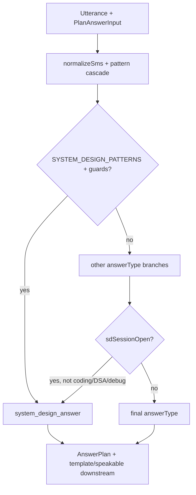

# Code patterns — SD routing / interviewer intention detection

**Topic:** Robust llm-eval coverage for `planAnswer` SD routing (`evals/sd-routing` + `SYSTEM_DESIGN_PATTERNS` + sticky `sdSessionOpen`)  
**Goal lens:** What is covered today vs what is missing for ~100% interviewer SD **intention** detection (not speakable output quality).

---

## Relevant Files

| Path | Relevance |
|------|-----------|
| `evals/sd-routing/cases.jsonl` | **20 llm-eval cases** — sole routing golden matrix; tags map to grilled `sd-route-*` glossary; `regression` (18) + `capability` (2). |
| `evals/sd-routing/threshold.yaml` | Gates **regression only** at `min_pass_rate: 1.0`; capability `track: true`, `min_pass_rate: 0.0`. |
| `evals/sd-routing/README.md` | Declares surface (`planAnswer` + sticky), glossary table, **“no leftover”** policy, run command. |
| `scripts/run-evals-sd-routing.mjs` | Contract runner: builds electron, calls `planAnswer`, graders `answer_type` / `answer_type_not` / `meta_tags_present`; exit SHIP/NO-SHIP. |
| `package.json` (`eval:sd-routing`) | npm entry → `node scripts/run-evals-sd-routing.mjs`. Not wired into `ci:tier*` or `release-gate.mjs`. |
| `electron/llm/AnswerPlanner.ts` (`632–658`) | `SYSTEM_DESIGN_PATTERNS` — title-form, like-X, classic nouns, scale-ask; comments reference `sd-route-*` tags. |
| `electron/llm/AnswerPlanner.ts` (`2543–2554`) | SD branch in `planAnswer`: patterns + `!hasWriteCodeVerb` + explain/what-is deferral unless design/scalable/architect present. |
| `electron/llm/AnswerPlanner.ts` (`2703–2713`) | **Sticky promote:** `sdSessionOpen === true` → force `system_design_answer` for non-coding/non-DSA/non-debugging turns (runs after full routing). |
| `electron/llm/AnswerPlanner.ts` (`201`, `2227+`) | `PlanAnswerInput.sdSessionOpen`; full routing order (meeting → product-about → SD → debugging → hypothetical tech → …). |
| `electron/llm/sdSessionAuthority.ts` | `deriveSdSessionAuthority` → `sessionOpen` (open `problemKey`), `shouldArmGate` (TI + sessionOpen). **Gate UI** uses `shouldArmGate`; **routing** uses `sessionOpen`. |
| `electron/IntelligenceEngine.ts` (`1586–1607`, `3148–3159`) | Live WTA + manual paths pass `sdSessionOpen: deriveSdSessionAuthority(...).sessionOpen` into `planAnswer`. |
| `electron/IntelligenceEngine.ts` (`1037`, `1119`, `1428`) | Early `planAnswer` calls for memory/follow-up/source gates — **omit `sdSessionOpen`** (accepted in local code-review as non-contract path). |
| `electron/llm/__tests__/AnswerPlannerValidator.test.mjs` (`51–94`) | Unit matrix mirroring eval positives/false friends + sticky clarifier/coding/unarmed; extra `explain design patterns` negative **not in evals**. |
| `electron/llm/__tests__/SdSessionAuthority*.test.mjs` | Gate arming / TI freeze / prepare — **artifact authority**, not answerType routing matrix. |
| `docs/adr/0004-sd-routing-hybrid-sticky.md` | Accepted ADR: hybrid front door + full eval coverage + sticky answerType; **rejects** ungated LLM leftover. |
| `docs/speakable-sd/CONTEXT.md` (`55–95`) | Human-readable routing glossary (`SD route positive`, …) — exported from grill; mirrors `sd-route-*` semantics. |
| `.scratch/sd-routing/PRD.md` | ~99% target, hybrid mechanism, no leftover, sticky promotion; user stories Q1–Q10. |
| `.scratch/sd-routing/issues/01–03*.md` | Implementation tickets (matrix, sticky, eval suite) — all marked **done**. |
| `evals/speakable-sd/cases.jsonl` + `scripts/run-evals-speakable-sd.mjs` | **Output** contract evals (DF template, TI speakable); one routing assert on Ticketmaster opener — **not** a routing matrix. |
| `scripts/verify-current-routing-decisions.mjs` | Ad-hoc probe harness for mixed audit hypotheses — includes `explain rate limiting` in H1 set, no SD-specific matrix. |
| `_workspace/grill-with-docs/01_question_log.md` | 10/10 verified grill Q&A defining all `sd-route-*` terms including hybrid LLM leftover promise. |
| `_workspace/code-review/sd-routing-local.md` | Pre-commit review: eval SHIP 15/15 (now 18 regression), sticky wired, early planAnswer sticky omission noted. |
| `electron/llm/IntentClassifier.ts` | WTA intent SLM — labels include `coding` only; **no `system_design` intent**; not used for SD routing except coding OR-override in `planAnswer`. |

---

## Potential Contradictions

### 1. README / PRD “no leftover” vs real coverage scope

- **Claim:** Every grilled `sd-route-*` term has ≥1 case; no ungated residual path (`evals/sd-routing/README.md`, ticket 03, ADR 0004).
- **Reality:** Meta case `sd-route-hybrid-matrix-covered` only asserts **tag presence in `cases.jsonl`**, not that production implements hybrid LLM leftover or that all **interviewer-intention scenario classes** are covered.
- **Gap:** Glossary coverage ≠ 100% SD intention detection. Many real interviewer openers (whiteboard, HLD walkthrough, architecture review, multi-turn section transitions) have **zero cases**.

### 2. Regression 100% gate vs capability fuzzy track

- **threshold.yaml:** `regression.min_pass_rate: 1.0` blocks ship; `capability.min_pass_rate: 0.0` is tracked only.
- **Tension:** PRD/grill target **~99% on messy ASR** but fuzzy cases are **explicitly not gated** until graduated. Claiming “100% intention detection” while capability fails silently conflicts with eval design (`00_memory.md` conflicts table).
- **Note:** Probed 2026-08-05 build — both capability cases (`designing uh…`, `how would you like scale…`) **currently pass** regex front door; capability suite may be ready to graduate but has not been retagged.

### 3. Hybrid LLM leftover promised but unimplemented

- **Grill Q9 / ADR / CONTEXT `SD route hybrid`:** Deterministic front door **plus** LLM classify on low-confidence leftovers; every path has eval goldens.
- **Code:** `planAnswer` SD routing is **regex-only** (+ sticky). `IntentClassifier` has no system-design label; `intentResult` only forces **coding** (`AnswerPlanner.ts:2613`), never SD.
- **Eval:** No case mode for LLM classify path; no confidence-threshold grader. **`sd-route-hybrid` is documentation/meta-tag only.**

### 4. Sticky promote vs false-friend glossary

- **Eval sticky cases:** Only clarifier (“consistency vs availability”), coding pivot (two sum), unarmed clarifier.
- **Code behavior:** Sticky promotes **any** non-coding/non-DSA/non-debugging turn — including negotiation, meeting recap, concept explain, experience years, sales (`planAnswer` sticky block has no identity/negotiation/meeting exclusions).
- **Contradiction:** `sd-route-not-experience` / `sd-route-not-concept` cases run with **`sdSessionOpen` absent/false**. Mid-SD interview, same utterances would become `system_design_answer`. Grill Q8 locks that as **intentional** for clarifiers, but evals do not document or gate the **override of false friends under sticky**.

### 5. `sessionOpen` vs `shouldArmGate` naming split

- `IntelligenceEngine` passes **`sessionOpen`** (any open problemKey) into `planAnswer`, not **`shouldArmGate`** (TI-only).
- Sticky answerType promotion can fire **outside Technical Interview mode** if artifact has `problemKey` — no eval case; gate UI may be inert while routing types as SD.

### 6. Stale `00_code_patterns.md` / pre-ship claims

- Prior doc said gerund/title forms **miss** routing; patterns now extended (`632–658`) and cases pass.
- Code-review cites “eval SHIP 15/15”; suite now has **18 regression + 2 capability** cases.

### 7. Output vs routing eval separation

- `speakable-sd` assumes correct `system_design_answer` typing (ADR 0003). Routing SHIP does not imply live Gemini opener quality (`sd-live-ticketmaster-opener` is separate capability in speakable-sd).

---

## Naming Inconsistencies

| Area | Variants | Notes |
|------|----------|-------|
| Glossary tags | `sd-route-positive` (eval) vs **SD route positive** (CONTEXT.md) vs “positive SD routing signals” (grill) | Same concept, three surface forms. |
| Answer type | `system_design_answer` (code) vs “system design” (human/ADR) vs `<system_design>` (TI prompt) | Same lane, different layers. |
| Speakable output | **Delivery Framework** / DF vs **SYSTEM_DESIGN_TEMPLATE** vs “speakable SD surface” | Output contract names ≠ routing names. |
| Sticky flag | `sdSessionOpen` (`PlanAnswerInput`) vs `sessionOpen` (`SdSessionAuthority`) vs “armed sticky SD session” (docs) vs `sd-session-open` (`00_memory.md`) | `shouldArmGate` is a third related flag (gate UI only). |
| Misroute | **sd-route-*** (wrong answerType) vs **speakable-sd-root-cause** misroute (DSA repair on SD turn) | Overloaded term; grill says prefer `sd-route-*` for classification. |
| Suite names | `regression` / `capability` (sd-routing) vs `contract` / `live` input modes (speakable-sd) | Both use regression/capability split but different graders and input shapes. |
| Eval runner label | Comment says “/llm-eval runner” but **no API/LLM** — pure `planAnswer` contract (unlike speakable-sd live mode). | “llm-eval” is organizational, not literal here. |
| Tag `fuzzy` | Used in cases 16–17 but **not** in README glossary table | Extra tag outside `sd-route-*` set. |

---

## Current Case Inventory

**Runner graders:** `answer_type`, `answer_type_not`, `meta_tags_present` only.  
**Input modes:** `route` (19 cases), `meta` (1 case). Fields: `question`, `source` (`what_to_answer` \| `manual_input`), optional `sdSessionOpen`.

| id | suite | tags | assert summary |
|----|-------|------|----------------|
| `sd-route-positive-design-scalable` | regression | `sd-route-positive` | → `system_design_answer` |
| `sd-route-positive-like-x-ticketmaster` | regression | `sd-route-positive` | → SD (manual) |
| `sd-route-positive-design-bitly` | regression | `sd-route-positive` | → SD (manual) |
| `sd-route-positive-design-twitter` | regression | `sd-route-positive` | → SD (manual) |
| `sd-route-positive-distributed-like-ticketmaster` | regression | `sd-route-positive` | → SD (manual) |
| `sd-route-title-form-ticketing` | regression | `sd-route-title-form` | → SD (gerund title) |
| `sd-route-not-experience-years` | regression | `sd-route-not-experience` | ≠ SD |
| `sd-route-not-coding-implement` | regression | `sd-route-not-coding` | ≠ SD |
| `sd-route-not-coding-two-sum` | regression | `sd-route-not-coding` | → `dsa_question_answer` |
| `sd-route-not-concept-explain` | regression | `sd-route-not-concept` | ≠ SD |
| `sd-route-not-product-about-natively` | regression | `sd-route-not-product-about` | → `project_about_answer` |
| `sd-route-scale-ask-checkout` | regression | `sd-route-scale-ask` | → SD |
| `sd-route-scale-ask-not-use-tool` | regression | `sd-route-scale-ask`, `sd-route-not-concept` | ≠ SD (GraphQL use) |
| `sd-route-sticky-clarifier` | regression | `sd-route-sticky` | sticky + CAP/PAC clarifier → SD |
| `sd-route-sticky-coding-pivot` | regression | `sd-route-sticky`, `sd-route-not-coding` | sticky + two sum → DSA |
| `sd-route-sticky-unarmed` | regression | `sd-route-sticky` | unarmed clarifier ≠ SD |
| `sd-route-no-soft-clarify-type` | regression | `sd-route-no-soft-clarify-type` | “hmm interesting” ≠ SD |
| `sd-route-hybrid-matrix-covered` | regression | `sd-route-hybrid` | meta: all glossary tags present |
| `sd-route-fuzzy-designing-asr` | capability | `sd-route-title-form`, `fuzzy` | ASR-ish gerund title → SD |
| `sd-route-fuzzy-scale-checkout` | capability | `sd-route-scale-ask`, `fuzzy` | messy scale-ask → SD |

**Glossary tag coverage (from meta case):** all 10 `sd-route-*` tags have ≥1 case.  
**Unit-test-only negatives (not in evals):** `explain design patterns` → ≠ SD (`AnswerPlannerValidator.test.mjs:67`).

**Probbed routing outcomes (built dist, 2026-08-05) — not in suite:**

| Utterance | `answerType` | Sticky note |
|-----------|--------------|-------------|
| `let's design a chat system` | `system_design_answer` | — |
| `design uber` / `Design Netflix` | `system_design_answer` | — |
| `architect a distributed cache` | `system_design_answer` | — |
| `give me an HLD for the notification system` | `system_design_answer` | — |
| `can you draw the architecture on the whiteboard` | `general_meeting_answer` | **miss** |
| `walk me through the high level design` | `skill_experience_answer` | **miss** |
| `review this architecture` | `general_meeting_answer` | **miss** |
| `tell me about your experience with distributed systems` | `skill_experience_answer` | unarmed ≠ SD; **sticky → SD** |
| `explain rate limiting` (sticky) | `technical_concept_answer` → **sticky → SD** | overrides `sd-route-not-concept` |
| `what is your salary expectation` (sticky) | **sticky → SD** | no case |
| `tell me about yourself` (sticky) | **sticky → SD** | no case |

---

## Coverage Gaps (scenario classes not in suite)

### A. Positive SD intention classes (interviewer wants design) — under-tested

1. **Multi-turn / section openers** — “OK let’s move to system design”, “next question: design…”, preamble + design ask; no case (probed: compound opener can hit SD via trailing `design` noun).
2. **Whiteboard / diagram requests** — “draw/sketch the architecture on the whiteboard”; routes `general_meeting_answer` today; no case.
3. **“Let’s design X” / collaborative framing** — works in probe but no dedicated case (distinct from bare `Design X`).
4. **Company / in-house product framing** — “design **our** payment platform”, “how would you scale **our** checkout” (only checkout variant covered); employer-specific product clone.
5. **Architecture review / critique** — “review this architecture”, “what would you change in this design?”; routes non-SD; no case defining intended behavior.
6. **HLD / walkthrough phrasing** — “walk me through the high level design”, “talk me through the architecture”; `skill_experience` or non-SD; no case.
7. **Architect/build variants** — `architect a distributed cache`, `build a platform similar to pinterest` pass regex but lack explicit cases (only scale-ask + like-X subsets covered).
8. **Explicit “system design question” meta** — “let’s do a system design interview question”; no case.
9. **Transcript source** — runner only sets `what_to_answer` / `manual_input`; no `source: 'transcript'` case (speakerPerspective differs).
10. **Classic noun grid** — patterns list ~15 products (`654`); evals cover Bit.ly, Twitter, Ticketmaster only; Uber/Netflix/Slack etc. untested in evals.

### B. False friends / negative intention — incomplete

Current set: years-on-distributed, implement rate limiter, two sum, explain rate limiting, Natively architecture, GraphQL use, vague “hmm interesting”, explain design patterns (unit only).

**Missing false-friend classes:**

11. **Experience phrasing variants** — “tell me about your scalable/distributed systems experience” (≠ years-only case).
12. **Behavioral past-design** — “tell me about a time you designed a scalable system” → `behavioral_interview_answer` (probed); no case.
13. **Project / résumé design history** — “how did you design the backend for your project” → `project_followup_answer`; no case.
14. **Debugging vs design** — “debug this distributed system crash” → debugging; no SD-negative case.
15. **Skill self-rating with “scale/system design”** — “rate yourself on system design out of 10” → `skill_experience_answer`; collision with scale-ask patterns; no case.
16. **Lecture / patterns** — “explain design patterns” (unit only); lecture-adjacent “system design patterns chapter”.
17. **Hypothetical tool/application** — only GraphQL; missing SQL/Kafka/Redis “how would you use X in production?” grid.
18. **Meeting / sales bleed** — “why is your product better” in SD session; sticky promotes to SD (probed); no intended-behavior case.
19. **Negotiation / identity under sticky** — salary, intro, action items → SD when sticky (probed); **high-risk gap** for intention detection.

### C. Sticky session scenarios — thin coverage

20. **Sticky + false-friend overrides** — experience/concept/negotiation/meeting under `sdSessionOpen: true` (behavior undefined in evals; code promotes to SD).
21. **Sticky + debugging pivot** — debugging excluded from promote (`2709–2710`); no case confirming cache/debug question stays debugging.
22. **Sticky + identity/intro** — probed: intro → SD; no case (likely unwanted).
23. **Authority integration** — no eval from `deriveSdSessionAuthority(artifact, modeId)` → `planAnswer`; no TI vs non-TI mode matrix.
24. **Mid-meeting SD cold open** — first SD question in a meeting with no prior artifact (`sdSessionOpen: false`); section-switch phrases untested.
25. **Leave TI / freeze** — `SdSessionAuthorityLeaveTiFreezeTier0` covers gate, not answerType routing.

### D. Mechanism / harness gaps (for “100%” claim)

26. **Hybrid LLM leftover path** — documented but **not implemented**; no eval for low-confidence classify → SD.
27. **Early planAnswer without sticky** — `_wtaPlan` / intent / negotiation probes (`IntelligenceEngine.ts:1428, 1037, 1119`) affect profile gates, not answer contract; end-to-end WTA routing under sticky not eval’d.
28. **`intentResult` interaction** — no case where SLM says `coding` vs regex says SD or vice versa.
29. **`extractedQuestion` / follow-up context** — no multi-turn extracted question routing cases.
30. **CI wiring** — `eval:sd-routing` not in `ci:tier1` or release gate; local/manual SHIP only.
31. **Graduation path** — capability cases passing but not promoted to regression; no `trials` enforcement in sd-routing runner (unlike speakable-sd docs).
32. **Output coupling** — no case asserts `formatAnswerPlanForPrompt` / DF template when sticky promotes (speakable-sd is separate).

### E. ASR / fuzzy / interruption — minimal

33. **Interruptions / partial utterances** — only 2 capability cases; no barge-in, repeated fillers, or truncated “design a scal—”.
34. **Speaker / ASR perspective** — no `speakerPerspective` edge cases; no interviewer-prefix noise (“Interviewer: design…”).

---

## Architecture snapshot (routing flow)

**Layers:** Eval runner → `planAnswer` only (L2). Live WTA → `deriveSdSessionAuthority.sessionOpen` → `planAnswer` (L2+L3). No L4 LLM SD classifier today.

---

## Essential files (minimal read set)

1. `evals/sd-routing/cases.jsonl` — what is gated  
2. `evals/sd-routing/threshold.yaml` — ship criteria  
3. `scripts/run-evals-sd-routing.mjs` — graders + seams  
4. `electron/llm/AnswerPlanner.ts` — `SYSTEM_DESIGN_PATTERNS`, SD branch, sticky promote  
5. `electron/llm/sdSessionAuthority.ts` + `electron/IntelligenceEngine.ts` (1586–1607) — sticky wiring  
6. `electron/llm/__tests__/AnswerPlannerValidator.test.mjs` — unit mirror + gaps  
7. `docs/adr/0004-sd-routing-hybrid-sticky.md` + `_workspace/grill-with-docs/01_question_log.md` — intended behavior vs code  
8. `evals/speakable-sd/cases.jsonl` — downstream output contract (orthogonal but dependent on routing)
