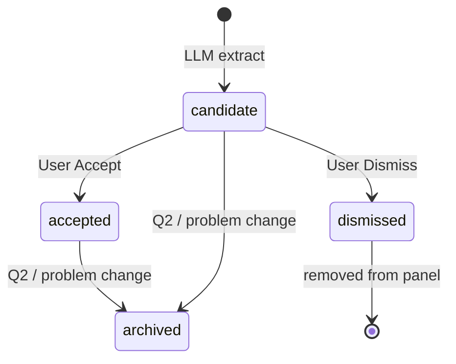

# Live Requirements List — PRD

Companion to [Technical Interview Copilot PRD](./technical-interview-copilot-PRD.md) and [GUIDE](./technical-interview-copilot-GUIDE.md).

---

## Problem

During coding and system-design segments, interviewers state constraints across many turns ("assume sorted", "millions of users", "O(n) time"). Today:

- `ActiveProblem.constraints` exists but is **never populated** from live speech.
- **Restate** may mention constraints in prose, but there is **no durable, user-controlled list**.
- **Dynamic actions** are ephemeral one-shot cards — **not** a requirements ledger.

Users need an always-visible, low-noise checklist: auto-suggested candidates, explicit **Accept** to pin, one-click **Dismiss** to reject.

---

## Goals

1. Continually extract requirement **candidates** from final transcript segments (LLM — not regex).
2. Show a compact overlay list in **technical-interview mode only**.
3. **Accept** pins to `ActiveProblem.constraints` and injects `<accepted_constraints>` into WTA, Restate, Lookup, and chat context.
4. **Dismiss** removes the row and **never** injects into prompts.
5. Archive requirements when the active problem changes (Q2 transition).

## Non-goals (v1)

- Regex/keyword extraction from free text
- Real-time extraction on interim partials (finals only)
- Cross-mode (sales, behavioral) requirement types
- Auto-accept without user confirmation
- Inline editing of requirement text

---

## User stories

| As a… | I want to… | So that… |
|-------|------------|----------|
| Candidate | Accept "Input is sorted" before hitting WTA | The copilot respects constraints I verified |
| Candidate | Dismiss a garbled STT artifact in one click | Bad rows never pollute my answer context |
| Candidate | See suggested vs accepted styling | I know what still needs my confirmation |

---

## Requirement taxonomy

| Type | Coding example | System design example |
|------|----------------|----------------------|
| I/O format | Return indices, not values | REST vs gRPC |
| Data constraint | Sorted input, no duplicates | Strong consistency required |
| Scale | n ≤ 10⁵ | 10M DAU, 1k QPS |
| Complexity | O(n) time, O(1) space | p99 < 200ms |
| Edge case | Empty array, single element | Multi-region failover |
| Non-functional | — | Availability vs consistency tradeoff |

---

## Data model

```typescript
interface LiveRequirement {
  id: string;
  text: string;                    // short speakable constraint
  status: 'candidate' | 'accepted' | 'dismissed';
  source: 'extracted' | 'manual';  // v1: extracted only
  evidence: { speaker: string; quote: string; timestamp: number };
  confidence: number;              // 0–1 from extractor
  createdAt: number;
  acceptedAt?: number;
}
```

### State machine



---

## UX spec

| Action | UI | Effect |
|--------|-----|--------|
| **Accept** | Check on row | `status → accepted`; sync to `ActiveProblem.constraints`; context update |
| **Dismiss** | X on row | Removed from panel; never in prompts |
| **Suggested** | Subtle label on candidates | Stays until user acts or session ends |

**Panel:** Max 8 visible rows; collapsible header "Requirements (n)"; below DynamicActionBar, above rolling transcript. Evidence quote on hover.

---

## Context contract

`buildInterviewContext()` exports `acceptedRequirements: string[]` from `ActiveProblem.constraints`.

`PromptAssembler` adds:

```xml
<accepted_constraints trust_level="user_confirmed">
- Input array is sorted
- No duplicate values
</accepted_constraints>
```

Feeds: WTA, Restate, Lookup, manual chat (via `formatInterviewContextForChat`).

---

## Extraction spec

| Parameter | Value |
|-----------|-------|
| Trigger | Final transcript segments, technical-interview mode |
| Debounce | 20s |
| Min finals before tick | 2 |
| Dedup | Normalized text + Jaccard ≥ 0.72 |
| Model | Shared tiny-tier via `LLMHelper.streamChat` |
| Output | JSON array: `{ text, quote, confidence }` |

Extraction failures log a warning and return `[]` — never block STT.

---

## Edge cases

| Case | Behavior |
|------|----------|
| Duplicate candidate | Dedup in store; not shown again |
| Contradiction | v1: user dismisses; v1.1: highlight conflict |
| Q2 / new problem | Archive accepted + candidates; clear panel |
| No active problem | Skip extraction tick |
| Mode switch away from TI | Pause extraction; hide panel; clear store |
| LLM hallucination | Evidence quote on hover; candidate only until Accept |

---

## Success metrics

| Metric | Target |
|--------|--------|
| Accepted constraint in WTA prompt within 1s of Accept | 100% |
| Dismissed item never in assembled prompt | 100% |
| Duplicate candidates after dedup | < 5% of rows |
| Extractor p95 latency (debounced tick) | < 2s TTFT |
| Dismiss in one click | No confirm dialog |

---

## Implementation phases

| Phase | Scope |
|-------|--------|
| A | `RequirementsStore`, `RequirementExtractorLLM`, `RequirementsEngine`, unit tests |
| B | IPC, accept→constraints sync, `InterviewContextBuilder`, `PromptAssembler` |
| C | `RequirementsPanel` in technical-interview mode |
| D | Q2 archive, telemetry, integration tests |

---

## Files

| File | Role |
|------|------|
| `electron/services/requirements/*` | Store, extractor, engine, types |
| `electron/IntelligenceEngine.ts` | Hook on final segments |
| `electron/ipcHandlers.ts` | `requirements:*` IPC |
| `src/components/requirements/RequirementsPanel.tsx` | Overlay UI |

---

## Test plan

- Unit: `RequirementsStore.test.mjs` — accept, dismiss, dedup, archive
- Unit: `PromptAssembler` — `<accepted_constraints>` block
- Integration: accepted constraint appears in `buildInterviewContext` + assembler output
- Manual: garbled STT → dismiss; real constraint → accept → WTA references it

---

## Open questions (post-v1)

- Clarify prompt: do not suggest asking about constraints already in accepted list
- Manual add requirement (v1.1)
- Persist accepted requirements in meeting metadata for debrief
