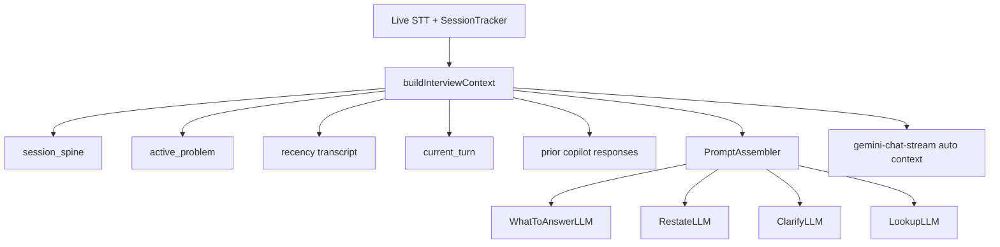

# Technical Interview Copilot — How It Works

Companion to the [PRD](./technical-interview-copilot-PRD.md) and [implementation notes](./technical-interview-copilot-IMPLEMENTATION.md). This document explains **behavior**, **data flow**, and **where to change things** in the codebase.

---

## What problem this solves

During a live technical interview, the copilot must remember:

1. **What problem is active** (even after a long pause or topic drift)
2. **What the interviewer just said** (including partial STT)
3. **What the copilot already suggested** (so it does not repeat itself)

Before this work, context was a flat “last N seconds” window. After a 5+ minute pause, manual chat and What to Answer could lose the original coding question. **Restate** and **Clarify** also shared the same shortcut and prompt, even though they do opposite things (interpret vs ask back).

The copilot now uses a **unified context builder** and **separate actions** for restate, clarify, lookup, brief, and debrief.

---

## Architecture at a glance



**Rule:** New intelligence features should call `buildInterviewContext()` — not ad-hoc `getFormattedContext(N)`.

| Layer | Source | Purpose |
|-------|--------|---------|
| **Session spine** | `SessionTracker.getFullSessionContext()` | Full meeting history + epoch summaries; survives long pauses |
| **Active problem** | `SessionTracker.getActiveProblem()` / detected coding question | Current question statement; archived when Q2 replaces Q1 |
| **Recency window** | Last ~180s prepared transcript + interim partial | What was said recently, sparsified for token budget |
| **Current turn** | `SessionTracker.getLastInterviewerTurn()` | Newest interviewer utterance, highlighted for the model |
| **Prior responses** | `TemporalContextBuilder` | Last few copilot answers (anti-repetition) |

Implementation: [`electron/services/context/InterviewContextBuilder.ts`](../../electron/services/context/InterviewContextBuilder.ts)

---

## Live actions (during a meeting)

### Technical-interview mode vs other modes

Several controls change when the active mode’s `templateType` is `technical-interview`:

| Control | Other modes | Technical-interview mode |
|---------|-------------|---------------------------|
| **Ctrl+2** | Clarify (ask interviewer a question) | **Restate** (interpret what they said) |
| **Ctrl+Shift+2** | — | **Ask** clarifying question |
| **Ctrl+3** | Recap / Brainstorm (per action-button setting) | **Lookup** (quick concept explainer) |
| **Answer Now** (Ctrl+5) | Generic chat prompt | Routes through **What to Answer** pipeline |

UI: [`src/components/NativelyInterface.tsx`](../../src/components/NativelyInterface.tsx)  
Keybinds: [`electron/services/KeybindManager.ts`](../../electron/services/KeybindManager.ts) (`chat:clarify`, `chat:askClarify`)

---

## Live Requirements List

Continually extracts interview **constraints** from final transcript segments (LLM JSON — not regex), shows them in a compact overlay, and lets the user **Accept** (pin to context) or **Dismiss** (one click, never in prompts).

| Action | Effect |
|--------|--------|
| Accept | Syncs to `ActiveProblem.constraints`; appears in `<accepted_constraints>` for WTA, Restate, Lookup, chat |
| Dismiss | Removed from panel; excluded from all prompts |
| Q2 / new problem | Archive prior requirements; clear panel |

**Scope:** `technical-interview` mode only. Panel: [`RequirementsPanel.tsx`](../../src/components/requirements/RequirementsPanel.tsx) — below DynamicActionBar.

**Backend:** [`electron/services/requirements/`](../../electron/services/requirements/) — debounced extractor (20s), normalized-text dedup.

**IPC:** `requirements:list`, `requirements:accept`, `requirements:dismiss`; push `requirements-updated`.

See [Live Requirements List PRD](./live-requirements-list-PRD.md).

---

### What to Answer (Ctrl+1)

**Purpose:** Generate a speakable answer for the current interviewer question.

**Flow:**

1. `IntelligenceEngine.runWhatShouldISay()` builds context via `buildInterviewContext()`.
2. Optional: `InterviewPhaseClassifier` updates session phase (async, LLM JSON — not regex on user text).
3. `WhatToAnswerLLM.generateStream()` assembles a `PromptAssembler` packet with spine, current turn, active problem, transcript, intent, and mode RAG.
4. Tokens stream to the overlay via batched IPC (`intelligence-token-batch`, kind `suggested_answer`).

**Explicit click behavior:** IPC handler passes `skipCooldown: true` so a manual button press is never silently dropped by the 3s cooldown.

---

### Restate (Ctrl+2 in technical-interview mode)

**Purpose:** Help the candidate **understand** what the interviewer asked — not ask the interviewer anything back.

**Output shape (prompt contract):**

- What they asked (plain language)
- Constraints already stated
- Ambiguities (flagged, not phrased as questions to the interviewer)
- Optional one-line “how to open your response”

**Flow:** `runRestate()` → `RestateLLM` → same interview context bundle → `RESTATE_MODE_PROMPT`.

**Contrast with Clarify:** Clarify produces **exact words to say to the interviewer** (`CLARIFY_MODE_PROMPT`). Restate never outputs a clarifying question.

IPC: `generate-restate`  
Events: `restate_token` (batched), `restate` (final)

---

### Ask clarifying question (Ctrl+Shift+2 in technical-interview mode)

**Purpose:** Generate **one** high-value question for the candidate to ask the interviewer (missing constraint, scale, edge case, etc.).

**Flow:** Unchanged `runClarify()` → `ClarifyLLM` + `CLARIFY_MODE_PROMPT`. Uses prepared transcript context (180s), not the full spine-first assembler path used by Restate/WTA.

IPC: `generate-clarify`

---

### Lookup (Ctrl+3 in technical-interview mode)

**Purpose:** 2–4 speakable sentences explaining a concept (e.g. “consistent hashing”, “CAP theorem”) **without** a full coding solution.

**Flow:**

1. `buildInterviewContext()` for live transcript + problem.
2. If live RAG has embedded chunks: `RAGManager.retrieveMeetingContext('live-meeting-current', query)` injects retrieved text as **untrusted** evidence in `PromptAssembler`.
3. `LookupLLM` streams with `LOOKUP_MODE_PROMPT`.

Optional IPC arg: `focusTerm` — if omitted, uses last interviewer turn as the query.

IPC: `generate-lookup`  
Events: `lookup_token` (batched), `lookup` (final)

---

### Answer Now (Ctrl+5)

**Purpose:** Stop voice capture and answer from what the candidate just said.

**Technical-interview behavior:** When there are no screenshot attachments, Answer Now calls `generateWhatToSay(question)` instead of `streamGeminiChat` with `CHAT_MODE_PROMPT`. That gives the same spine + active-problem context as manual WTA.

**Other modes:** Unchanged — RAG live query or generic chat prompt.

---

### Manual chat (typed input in overlay)

**Purpose:** Freeform questions during the meeting.

**Context injection:** Before the user message is added to the session, `getInterviewContextForChat()` runs `buildInterviewContext()` + `formatInterviewContextForChat()`. The formatted string (spine, active problem, current turn, recency transcript, prior responses) is passed to `gemini-chat-stream`.

This replaces the old 100-second flat `getFormattedContext(100)` inject, which dropped early-session content after pauses.

---

## Reliability: stale streams and cooldown

### Overlay generation ID (Fix 4 / Repro C)

When the user submits manual chat or starts a new intelligence action, the renderer bumps `overlayGenerationIdRef`. IPC listeners for WTA tokens and final answers **ignore** events when the generation ID does not match the one accepted at action start.

This prevents a slow Restate/WTA stream from flooding the UI after the user has moved on (e.g. typed “What?” in chat).

Location: [`src/components/NativelyInterface.tsx`](../../src/components/NativelyInterface.tsx) — `beginIntelligenceGeneration`, `bumpOverlayGeneration`, `isIntelligenceGenerationCurrent`.

### Cooldown bypass (Fix 5 / Repro A)

Automatic/speculative WTA respects a ~3s cooldown. **Explicit** WTA button clicks use `skipCooldown: true` in [`electron/ipcHandlers.ts`](../../electron/ipcHandlers.ts) so the user never gets a silent blank on intentional click.

---

## Session memory: active problem and phases

### Active problem (`SessionTracker`)

Structured model when a coding/system-design question is detected:

```typescript
{
  type: 'coding' | 'system_design' | 'behavioral' | 'general',
  statement: string,
  constraints: string[],
  assumptions: string[],
  source: 'screenshot' | 'transcript' | 'manual',
  setAt: number,
  phase: InterviewPhase,
}
```

- Set when `setCodingQuestion()` runs (screenshot “Solve” or transcript detection).
- **Q2 replaces Q1:** previous problem is pushed to `archivedProblems[]`.
- Screenshot question is sticky for 3 minutes; transcript can override after that or if the prior question was also from transcript.

Exposed on `InterviewContextBundle.activeProblemStatement` for prompts.

### Interview phase

`InterviewPhaseClassifier` calls the LLM with a JSON-only prompt:

`behavioral | coding | system_design | candidate_qa | unknown`

Runs asynchronously during WTA; updates `SessionTracker.setInterviewPhase()`. Not used for regex routing on free text.

### Coding transcript sparsify

When a problem is active (`problemSetAt`), `prepareTranscriptForWhatToAnswer()` keeps **all interviewer turns since the problem was set** and raises the turn budget (up to 24). That preserves constraint mentions across a long coding segment without blowing the context window.

Location: [`electron/llm/transcriptCleaner.ts`](../../electron/llm/transcriptCleaner.ts)

---

## Lifecycle: before and after the call

### Pre-call brief (launcher)

**User flow:** Connect Google Calendar on the launcher → upcoming event card → **Pre-call brief**.

**Backend:** `get-meeting-brief` IPC → `MeetingBriefLLM` with event title, time, attendees, active mode name. If technical-interview mode is active, triggers `RAGManager.retryPendingEmbeddings()` to warm reference-file RAG.

Files: [`electron/llm/MeetingBriefLLM.ts`](../../electron/llm/MeetingBriefLLM.ts), [`src/components/Launcher.tsx`](../../src/components/Launcher.tsx)

### Post-call debrief (meeting history)

**When:** `MeetingPersistence.processAndSaveMeeting()` after stop, for meetings where mode snapshot was `technical-interview`.

**What:** `DebriefLLM` reads full session context + copilot usage log + missed-opportunity heuristics → narrative debrief stored in `detailedSummary.debrief`.

**UI:** Meeting details → **Debrief** tab (shown when debrief text exists).

Files: [`electron/llm/DebriefLLM.ts`](../../electron/llm/DebriefLLM.ts), [`src/components/MeetingDetails.tsx`](../../src/components/MeetingDetails.tsx)

### Late join

If the candidate joins mid-session with sparse live context but rich spine, `generate-late-join-backfill` calls `runLateJoinBackfill()` (currently delegates to Restate over full spine). Wire this to a explicit UI affordance when you add “Summarize what I missed.”

---

## PromptAssembler blocks

All spine-aware LLM paths should go through [`PromptAssembler`](../../electron/services/context/PromptAssembler.ts):

| Block | XML tag | Trust |
|-------|---------|-------|
| Session spine | `<session_spine>` | Untrusted transcript |
| Active problem | `<active_problem>` | Detected problem |
| Current turn | `<current_turn>` | Untrusted transcript |
| Recency | `<transcript>` | Untrusted transcript |
| Prior copilot answers | assistant history block | Anti-repetition |
| Live RAG (Lookup) | retrieved mode context | Untrusted reference |

Injection patterns in reference content are escaped, not dropped.

---

## IPC and events reference

| Renderer API | IPC channel | Engine method |
|--------------|-------------|---------------|
| `generateWhatToSay()` | `generate-what-to-say` | `runWhatShouldISay` |
| `generateRestate()` | `generate-restate` | `runRestate` |
| `generateClarify()` | `generate-clarify` | `runClarify` |
| `generateLookup(term?)` | `generate-lookup` | `runLookup` |
| `generateLateJoinBackfill()` | `generate-late-join-backfill` | `runLateJoinBackfill` |
| `getMeetingBrief(eventId?)` | `get-meeting-brief` | `MeetingBriefLLM.generate` |
| `streamGeminiChat()` | `gemini-chat-stream` | uses `getInterviewContextForChat()` |

Streaming token batches (main → renderer): kinds include `suggested_answer`, `restate`, `lookup`, `clarify`, `recap`, `follow_up_questions`.

Preload: [`electron/preload.ts`](../../electron/preload.ts)  
Types: [`src/types/electron.d.ts`](../../src/types/electron.d.ts)

---

## Tests

| Test file | What it checks |
|-----------|----------------|
| `electron/services/__tests__/InterviewContextBuilder.test.mjs` | Spine retained after pause; chat formatting |
| `electron/services/__tests__/PromptAssembler.test.mjs` | spine / current_turn / active_problem blocks |
| `electron/llm/__tests__/RestateLookupLLM.test.mjs` | Prompt contracts (no clarify in Restate; no full solution in Lookup) |
| `electron/services/__tests__/IntelligenceEngineCooldown.test.mjs` | Cooldown + skipCooldown |

Run:

```bash
npm run build:electron
node --test electron/services/__tests__/InterviewContextBuilder.test.mjs \
  electron/services/__tests__/PromptAssembler.test.mjs \
  electron/llm/__tests__/RestateLookupLLM.test.mjs
```

---

## Extending safely

1. **New live action?** Add an LLM module, call `buildInterviewContext()`, assemble via `PromptAssembler`, add IPC + preload + overlay intent + batch kind in `main.ts`.
2. **More problem fields?** Extend `ActiveProblem` in `SessionTracker`; pass through `InterviewContextBundle` and `PromptAssembler.activeProblem`.
3. **Phase-aware behavior?** Read `session.getInterviewPhase()` in engine runners — do not regex-classify user free text (workspace rule).
4. **Do not** reintroduce `getFormattedContext(100)` for interview paths; extend the builder instead.

---

## Related docs

- [PRD — requirements and success metrics](./technical-interview-copilot-PRD.md)
- [Live Requirements List PRD](./live-requirements-list-PRD.md) — continual constraint extraction, Accept/Dismiss overlay
- [Implementation plan — file-level checklist](./technical-interview-copilot-IMPLEMENTATION.md)
- CCDD repro notes: `tmp/collective-collaborative-deep-dive/2026-05-26_what-to-answer-deferred-flood/REPORT.md` (WTA blank/flood bugs that P0 fixes address)
