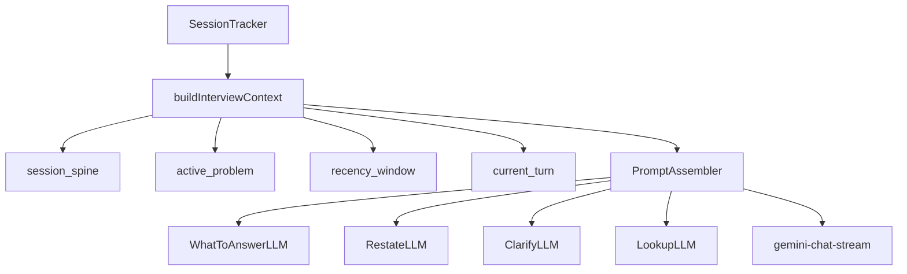

# Technical Interview Copilot — Implementation Plan

**Status:** Draft  
**Last updated:** 2026-05-26  
**PRD:** [technical-interview-copilot-PRD.md](./technical-interview-copilot-PRD.md)  
**How it works (behavior + architecture):** [technical-interview-copilot-GUIDE.md](./technical-interview-copilot-GUIDE.md)

---

## Baseline (already in repo)

Several P0 items from the CCDD report are **partially or fully done** — do not re-implement:

| PRD ID | Status | Evidence |
|--------|--------|----------|
| R1 WTA placeholder | **Done** | `handleWhatToSay` → `prepareIntelligenceStreamPlaceholder('what_to_answer')` (`src/components/NativelyInterface.tsx`) |
| R2 Cooldown null feedback | **Done** | `applyWhatToAnswerNullFeedbackMessages` on null answer; tests in `src/lib/__tests__/whatToAnswerNullResult.test.mjs` |
| R3 Finalize by streaming id | **Done** | `finalizeStreamingByIntentMessages(..., streamingMsgId)` in `src/lib/overlayMessagePersistence.mjs` |
| R5 Manual cooldown bypass | **Not done** | `skipCooldown` only when `NODE_ENV === 'test'` (`electron/ipcHandlers.ts`) |
| R4 Stale IPC guard | **Not done** | No generation token on manual submit |
| R6 Unified context | **Not done** | `getFullSessionContext()` unused; gemini-chat still auto-injects 100s |
| P1–P5 features | **Not started** | No `RestateLLM`, `LookupLLM`, `buildInterviewContext`, `ActiveProblem` |

**Recently shipped (orthogonal to PRD):** resizable chat panel + sticky-note pop-outs.

---

## Architecture target

All live intelligence paths converge on one context builder:



**Rule:** No new ad-hoc `getFormattedContext(N)` in feature work — extend `buildInterviewContext()` instead.

---

## Phase 0 — Finish reliability + context foundation (3–4 days)

**Goal:** Green CCDD repro checklist + session spine available to WTA and manual chat.

### PR-0A: Manual WTA cooldown bypass + stale IPC guard

**Files:** `electron/ipcHandlers.ts`, `src/components/NativelyInterface.tsx`, `electron/IntelligenceEngine.ts`

- Pass `skipCooldown: true` from `generate-what-to-say` for explicit button clicks (not speculative prefetch).
- Add renderer `overlayGenerationIdRef`; increment on `handleManualSubmit` and each quick-action start.
- Ignore `intelligence-token-batch` / `intelligence-suggested-answer` when generation id ≠ current.

**Acceptance:** CCDD Repro A (no silent blank); Repro C (no flood after manual submit).

### PR-0B: `buildInterviewContext()` v1

**New:** `electron/services/context/InterviewContextBuilder.ts`

**Wire into:** `IntelligenceEngine.runWhatShouldISay`, other run* modes, `gemini-chat-stream` (replace 100s auto-inject).

**v1 bundle:**
- `spine` — `SessionTracker.getFullSessionContext()`
- `recency` — 180s prepared transcript + interim partial
- `currentTurn` — last interviewer turn
- `priorCopilotResponses` — last 3 assistant answers

**Acceptance:** After 5 min pause, manual "what was the question?" includes spine content. Test: `electron/services/__tests__/InterviewContextBuilder.test.mjs`.

### PR-0C: PromptAssembler context blocks

**Files:** `electron/services/context/PromptAssembler.ts`, existing PromptAssembler tests

- Emit `<session_spine>`, `<transcript>`, `<current_turn>`
- `<active_problem>` stub using `detectedCodingQuestion` until Phase 3

### P0 exit gate

CCDD repro checklist (`tmp/collective-collaborative-deep-dive/2026-05-26_what-to-answer-deferred-flood/REPORT.md`) + targeted `npm test` green.

---

## Phase 1 — Restate + context parity (4–6 days)

### PR-1A: RestateLLM

**New:** `electron/llm/RestateLLM.ts`, `RESTATE_MODE_PROMPT` in `prompts.ts`

Output: what they asked → constraints → ambiguities → optional next step. Never a clarifying question.

**Wire:** `runRestate`, IPC `generate-restate`, streaming intent `restate`.

### PR-1B: Split Clarify UI

| Control | Shortcut (technical-interview mode) | Backend |
|---------|-------------------------------------|---------|
| Restate | Ctrl+2 | `runRestate` |
| Ask clarifying question | Ctrl+Shift+2 | `runClarify` |

Update `KeybindManager.ts`, `NativelyInterface.tsx`, `HelpSettings.tsx`.

### PR-1C: Answer Now parity

Route voice Answer Now through WTA context + mode prompts in technical-interview mode (not `CHAT_MODE_PROMPT`).

### PR-1D: Coding sparsify budget

In `transcriptCleaner.ts`: when active problem set, keep all interviewer turns since `setAt`; raise max turns for coding phase.

**P1 exit gate:** Restate vs Ask verified on garbled ASR fixture; manual chat = WTA context bytes.

---

## Phase 2 — Lookup (4–5 days)

### PR-2A: LookupLLM + IPC

**New:** `electron/llm/LookupLLM.ts`, `LOOKUP_MODE_PROMPT`, `generate-lookup` IPC

2–4 speakable sentences; no code blocks / full solutions.

### PR-2B: Overlay button

Ctrl+3 in technical-interview mode; stream card intent `lookup`.

### PR-2C: Live RAG

Query `LiveRAGIndexer` chunks on Lookup; inject as untrusted evidence in PromptAssembler.

**P2 exit gate:** p95 TTFT < 3s; eval set never returns full coding solution.

---

## Phase 3 — Problem State + phases (1–2 weeks)

### PR-3A: ActiveProblem model

**File:** `electron/SessionTracker.ts`

Structured `{ type, statement, constraints, assumptions, source, setAt, phase }`. Archive Q1 when Q2 detected.

### PR-3B: InterviewPhaseClassifier

LLM-based phase label: behavioral | coding | system_design | candidate_qa (not regex on free text).

### PR-3C: Late-join backfill

"Summarize what I missed" on meeting start when session empty.

### PR-3D: Phase-aware Recap / WTA

Recap and WTA format follow detected phase.

**P3 exit gate:** Two coding questions — WTA answers Q2 only; phase ≥ 90% on eval corpus.

---

## Phase 4 — Pre-call brief (1–2 weeks)

- Wire `CalendarManager.ts` to launcher (15 min before event)
- `MeetingBriefLLM.ts` + brief panel UI
- Mode auto-select + warm RAG preload

**P4 exit gate:** Brief before join; first WTA has no cold-start.

---

## Phase 5 — Post-call debrief (1–2 weeks)

- `DebriefLLM.ts` on `endMeeting`
- Meeting history debrief tab + export
- Missed-opportunity timestamps for debrief (v1 heuristic)

**P5 exit gate:** Debrief on stop; problem archive in history.

---

## PR merge order

```
PR-0A → PR-0B → PR-0C → PR-1A → PR-1B → PR-1C → PR-2A → PR-2B → PR-2C
  → PR-3A → PR-3B → PR-3C → PR-3D → PR-4 → PR-5
```

P4 can parallel late P2 once context builder exists.

---

## Test strategy

| Layer | Per phase |
|-------|-----------|
| Unit | Context builder, Restate/Lookup LLMs, ActiveProblem, generation id dedup |
| Integration | WTA vs gemini-chat spine parity |
| Manual | PRD Appendix C QA matrix |
| Fixtures | `electron/test/fixtures/interview-transcripts/` — pause, Q1/Q2, garbled ASR |

No regex intent routing on user free text (workspace rule).

---

## Timeline estimate

| Phase | Duration | Cumulative |
|-------|----------|------------|
| P0 | 3–4 days | ~1 week |
| P1 | 4–6 days | ~2 weeks |
| P2 | 4–5 days | ~3 weeks |
| P3 | 7–10 days | ~5 weeks |
| P4 | 7–10 days | ~7 weeks |
| P5 | 7–10 days | ~9 weeks |

---

## Sprint 1 (recommended start)

1. **PR-0A** — cooldown bypass + stale IPC (smallest diff, fixes blank/flood)
2. **PR-0B** — `buildInterviewContext()` + gemini-chat wiring (fixes context loss after pauses)
3. **PR-0C** — PromptAssembler spine + current_turn blocks

Sprint 2: Restate split (P1) — fixes Clarify semantic mismatch.
