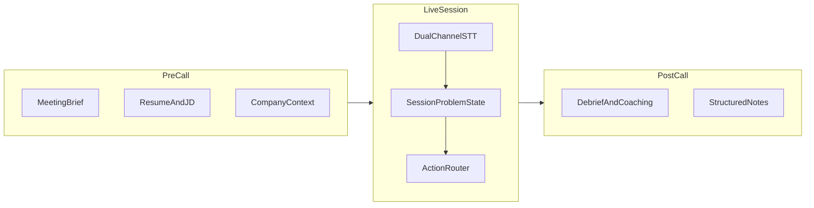
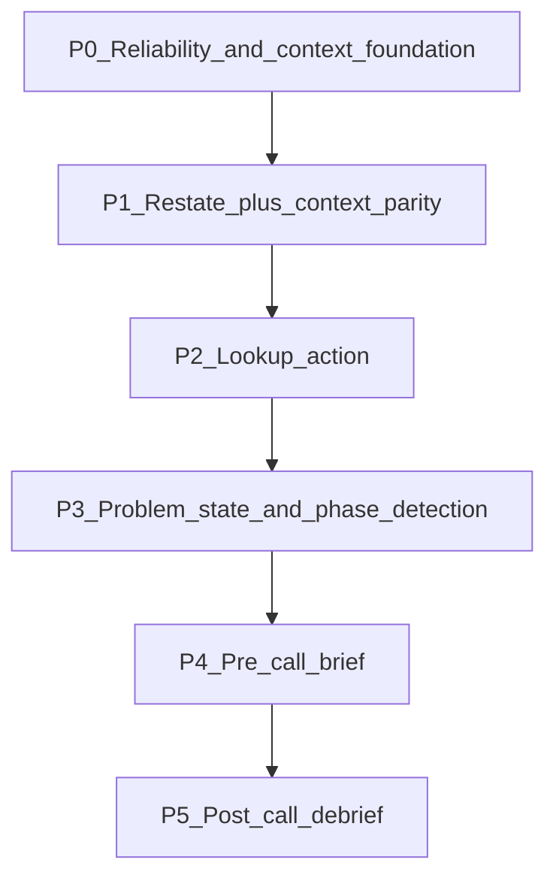

# Technical Interview Copilot — Product Requirements Document

**Status:** Draft  
**Owner:** TBD  
**Last updated:** 2026-05-26  
**Related docs:** [NATIVELY_CLUELY_PARITY_ROADMAP.md](../engineering/NATIVELY_CLUELY_PARITY_ROADMAP.md), [linux-x11-audio-contract.md](../engineering/linux-x11-audio-contract.md)  
**Related CCDD:** `tmp/collective-collaborative-deep-dive/2026-05-26_what-to-answer-deferred-flood/`

---

## Problem statement

Natively runs on Linux and captures live meeting audio, but **complex technical interviews expose architectural limits** that make the product feel shallow when it matters most. Early wins (STT, overlay, basic What to Answer) do not scale to a full 45–90 minute loop covering behavioral intro, live coding, system design, and candidate Q&A.

| User pain | Root cause in code today |
|-----------|-------------------------|
| **Clarify doesn't clarify** — user expects explanation of what was said/heard | `CLARIFY_MODE_PROMPT` (`electron/llm/prompts.ts`) generates a **question for the candidate to ask the interviewer**, not a restatement or interpretation of the interviewer's words |
| **No lookup** — can't quickly understand terms, patterns, or what the interviewer is referencing | No live lookup action; `RAGRetriever` `speaker_lookup` is post-meeting only; parity docs flag missing "Who am I talking to?" / fact-check |
| **Context drops after pauses** — manual questions only see the tail end | Live paths use short rolling windows (100–180s) and 12-turn sparsification (`electron/llm/transcriptCleaner.ts`); manual chat auto-injects 100s (`electron/ipcHandlers.ts`); UI `conversationContext` is last 20 overlay messages, not session transcript (`src/components/NativelyInterface.tsx`); `getFullSessionContext()` exists in `SessionTracker` but is **not wired** into live intelligence paths |
| **What to Answer unreliable** | Known streaming/cooldown bugs (CCDD report: `tmp/collective-collaborative-deep-dive/2026-05-26_what-to-answer-deferred-flood/REPORT.md`) |
| **Fragmented answer paths** | What to Answer (structured) vs Answer Now (`gemini-chat-stream` + `CHAT_MODE_PROMPT`) vs screenshot 4-phase pipeline — three different coding-interview flows |

This PRD defines the **target product behavior** for a software engineer in a **full-loop interview** (behavioral intro → coding → system design → candidate Q&A) across the **full lifecycle** (prep → live → debrief).

---

## Goals

1. **Session-aware assistance** — maintain durable interview state (active problem, phase, constraints) across pauses, phase transitions, and multiple questions in one session.
2. **Purpose-built actions** — each overlay button does one clear job; Clarify is split into Restate vs Ask; Lookup is a first-class action.
3. **Context parity** — manual chat, voice Answer Now, and quick actions all receive the same interview context stack.
4. **Full lifecycle coverage** — pre-call brief, live copilot, post-call debrief for a technical loop.
5. **Glance-and-go UX** — every output is speakable or typeable without translation; optimized for a senior engineer in a live call.
6. **Reliability first** — fix known What to Answer streaming/cooldown bugs before expanding surface area.

## Non-goals

- Mock interview simulator (separate product surface)
- Auto-answering without explicit user trigger (stealth/autonomous agent)
- Cheating-detection evasion features
- Wayland-specific support (per ADR 0001)
- Real-time web search in v1 Lookup
- Replacing the candidate's voice or typing autonomously

---

## Product vision

Natively is a **session-aware interview copilot** that maintains a durable **Problem State** for the active interview, surfaces the right assistance at the right moment through purpose-built actions, and never loses the thread — even after long pauses, phase changes, or garbled audio.



---

## User personas

### Persona A — Alex (primary): mid/senior SWE in a remote technical loop

- **Setup:** Zoom/Google Meet + shared CoderPad, LeetCode, HackerRank, or IDE screen share
- **Interview shape:** 45–90 minutes — behavioral intro (10–15 min) → coding (25–35 min) → system design or second coding round (20–30 min) → candidate Q&A (5–10 min)
- **Needs:** hear interviewer clearly, understand the **current problem**, recover from ASR garble, ask smart clarifications, think aloud credibly, get hints without full spoilers, retain context across awkward silences
- **Success criterion:** feels like a **senior engineer whispering in their ear**, not a generic chatbot with amnesia

### Persona B — Jordan: staff engineer doing system-design-heavy loops

- **Needs:** constraint clarification, architecture tradeoffs, technology lookup (Kafka vs RabbitMQ, CAP), phase-aware recap
- **Success criterion:** can pivot from whiteboard verbal design to follow-up deep dives without losing earlier constraints

### Persona C — Sam: candidate who starts the meeting before opening Natively

- **Needs:** backfill or summarize missed context; active problem detection from partial transcript
- **Success criterion:** joining 10 minutes late does not permanently blind the copilot

---

## Current state (verified in repo)

| Area | Current behavior | Gap vs target |
|------|------------------|---------------|
| Clarify button | Generates one question for candidate to ask interviewer | User expects restatement/interpretation of what was said |
| Lookup | Post-meeting RAG `speaker_lookup` only | No live term/concept/pattern explainer |
| Context window | 100–180s rolling + 12-turn sparsify | Drops after 5+ min pause; manual chat uses 100s auto-inject |
| Full session context | `getFullSessionContext()` exists | Not wired to live intelligence paths |
| `<current_turn>` | Referenced in prompts | `PromptAssembler` does not emit it |
| What to Answer | Primary structured path | Streaming placeholder race; cooldown silent blank |
| Answer Now | `gemini-chat-stream` + `CHAT_MODE_PROMPT` | Different prompt/context from What to Answer |
| Assist mode | Backend + IPC exist | No overlay button; passive-only implementation |
| Pre-call brief | `CalendarManager.ts` exists | Unused in main flow |
| Post-call coaching | Partial meeting persistence | No structured debrief module |
| Problem tracking | `detectedCodingQuestion` string | No structured Problem State or phase model |
| Pre-app audio | Not in `SessionTracker` | Context missing if user starts Meet first |

---

## Session memory model (foundational)

Replace today's flat 180s window with a **three-layer context stack**. All intelligence paths must call a unified `buildInterviewContext()` — not ad-hoc `getFormattedContext(N)`.

### Layer 1 — Session spine (whole meeting, never dropped)

**Contents:**
- Epoch summaries from long-meeting compaction (`SessionTracker.compactTranscriptIfNeeded`)
- Phase markers: `behavioral` | `coding` | `system_design` | `candidate_qa`
- Archived problems list (Q1, Q2, … with statements and outcomes)
- Key constraints already established (deduplicated)

**Injection rule:** Always included in prompts for every live action and manual chat, subject to model context budget (summaries compress; never omit active problem).

**Source:** `SessionTracker.fullTranscript`, epoch summaries, phase/problem metadata (new).

### Layer 2 — Active problem (current question)

**Structured object:**

```typescript
interface ActiveProblem {
  type: 'behavioral' | 'coding' | 'system_design' | 'general';
  statement: string;           // normalized problem text
  constraints: string[];       // e.g. "sorted input", "O(n) time"
  examples?: string[];
  assumptions: string[];       // candidate or copilot assumed
  source: 'transcript' | 'screenshot' | 'manual';
  setAt: number;               // epoch ms
  phase: InterviewPhase;
}
```

**Update rules:**
- Screenshot via Capture & Ask → authoritative; replaces transcript-derived problem
- New explicit coding question in transcript → archive prior problem to spine; set new active problem
- System design prompt detected → switch type; retain constraints from clarification turns
- Stale screenshot problem (> 3 min, no activity) → allow transcript override (extends existing `SCREENSHOT_STALE_MS` logic)

**Extends:** existing `detectedCodingQuestion` in `SessionTracker.ts`.

### Layer 3 — Recency window (last 3–5 min)

**Contents:**
- Verbatim turns (interviewer weighted)
- Interim interviewer partial (`getContextWithInterim`)
- Last 3 assistant/copilot responses (anti-repetition)

**Default window:** 180s for coding/system design; 120s for behavioral; configurable per phase.

### Context assembly contract

```typescript
interface InterviewContextBundle {
  spine: string;              // Layer 1 formatted
  activeProblem: ActiveProblem | null;
  recencyTranscript: string;  // Layer 3 formatted
  currentTurn: string | null; // newest interviewer turn, explicit block
  priorCopilotResponses: string[];
  phase: InterviewPhase;
}
```

**Prompt blocks emitted by `PromptAssembler`:**
- `<session_spine>` — Layer 1
- `<active_problem>` — Layer 2 JSON or prose
- `<transcript>` — Layer 3
- `<current_turn>` — explicit newest turn (fixes prompt/assembler mismatch)

### Context retention SLAs

| Scenario | Required context | Acceptance test |
|----------|------------------|-----------------|
| 30s after interviewer finishes question | Full active problem + last 3 turns | Eval: WTA references correct problem statement |
| 5 min silence; user types "what was the question again?" | Active problem from spine, not last 100s | Eval: 95% correct restatement on pause corpus |
| Second coding question in same session | Q1 in spine; Q2 active; WTA answers Q2 only | Eval: no Q1 algorithm in Q2 response |
| User started Meet 10 min before Natively | Backfill prompt or import path | Eval: user can recover problem statement within 1 action |
| Manual chat mid-interview | Same bundle as What to Answer | Eval: context byte parity between paths |
| Garbled ASR ("cash or cache?") | Restate flags ambiguity before coding | Eval: no code block until restated or clarified |

### Pre-app audio

When the user starts an external meeting recording before Natively:
- **v1:** On meeting start, offer "Summarize what you missed" (uses partial STT from join moment + user paste optional)
- **v2:** Recall/desktop SDK backfill if available

---

## Live overlay — action catalog

Technical Interview mode quick actions (replaces current overloaded button row):

| # | Label | Shortcut | Intent ID | Purpose |
|---|-------|----------|-----------|---------|
| 1 | **What to answer?** | Ctrl+1 | `what_to_answer` | Primary: what to say/type next |
| 2 | **Restate** | Ctrl+2 | `restate` | Interpret what interviewer said — plain-language problem, extracted constraints, "what they're really asking" |
| 3 | **Ask clarifying question** | Ctrl+Shift+2 | `ask_clarify` | One smart question for candidate to ask interviewer (current Clarify behavior) |
| 4 | **Lookup** | Ctrl+3 | `lookup` | Explain term/concept/pattern from context; 2–4 sentences |
| 5 | **Brainstorm** | Ctrl+4 | `brainstorm` | Approach exploration without full code |
| 6 | **Code Hint** | Ctrl+5 | `code_hint` | Minimal nudge when stuck on code |
| 7 | **Recap** | Ctrl+6 | `recap` | Phase-aware summary |
| 8 | **Follow-up questions** | Ctrl+7 | `follow_up_questions` | Questions candidate can ask interviewer |

**Migration from today:**

| Current | Target |
|---------|--------|
| Clarify (Ctrl+2) | **Restate** (Ctrl+2) in technical-interview mode; Ask clarifying question on Ctrl+Shift+2 |
| Recap/Brainstorm toggle (Ctrl+3) | Brainstorm moves to Ctrl+4; Recap to Ctrl+6 |
| Answer Now (Ctrl+5) | Merged into What to Answer context path; mic capture feeds same pipeline |
| Code Hint (Ctrl+6) | Ctrl+5 |
| Brainstorm (Ctrl+7) | Ctrl+4 |

### Action specifications

#### What to answer? (`what_to_answer`)

**Purpose:** Generate exactly what the candidate should say or type next.

**Phase behavior:**

| Phase | Output format |
|-------|---------------|
| Behavioral | First-person STAR; 3–4 speakable sentences; grounded in resume/profile |
| Coding | Think-aloud → code block → dry run → time/space/edge cases (per `MODE_TECHNICAL_INTERVIEW_PROMPT`) |
| System design | Constraints → components → data flow → tradeoffs → scale/failure modes |
| Candidate Q&A | Best question(s) to ask, drawn from brief + session |

**Inputs:** Full `InterviewContextBundle` + mode suffix + optional screen context + attached screenshots.

**Guards:**
- Garbled/ambiguous problem → restatement or clarifying question, not code
- Explicit manual click bypasses speculative cooldown
- Streaming placeholder pre-wired before IPC (CCDD Fix 1)

#### Restate (`restate`) — NEW

**Purpose:** Help the candidate understand what was said — NOT generate a question to ask back.

**User story:** "The interviewer said something about LRU cache and virtual nodes but the transcript is messy — what are they actually asking?"

**Output structure (speakable, no headers in UI):**
1. **What they asked** — one plain-language sentence
2. **Constraints heard** — bullet list (only if present in transcript)
3. **Ambiguities** — "Unclear: …" if ASR garbled
4. **Suggested next step** — "You could confirm X before coding" (optional, one line)

**Prompt persona:** Interpretation specialist, not clarification question generator.

**Distinct from Ask clarifying question:** Restate is for the candidate's understanding; Ask is words to speak to the interviewer.

#### Ask clarifying question (`ask_clarify`)

**Purpose:** Preserve current `CLARIFY_MODE_PROMPT` behavior — one high-value question for the candidate to ask aloud.

**Hierarchy:** Scale → memory → edge cases → output format (coding); consistency/scale/failure (system design).

**Rule:** Never ask about constraints already stated in transcript.

#### Lookup (`lookup`) — NEW

**User story:** "The interviewer said 'consistent hashing with virtual nodes' — I need a 10-second refresher without breaking flow."

| Field | Spec |
|-------|------|
| Input | Active problem + recency transcript + optional user-selected/highlighted term |
| Output | 2–4 speakable sentences; optional "Related: …" line; **never** a full interview answer |
| Sub-intents | `term_definition`, `pattern_explainer`, `company_context`, `problem_parsing` |
| Sources | LLM knowledge → mode reference files → live meeting RAG (`LiveRAGIndexer`) → user profile |
| UX | Streams to overlay card labeled **Lookup**; pin-friendly; copy button |
| Safety | No hallucinated company facts; prefix uncertainty ("If they mean X…") |

#### Brainstorm (`brainstorm`)

**Purpose:** Explore approaches without committing to code.

**Format:** Naive → key insight → optimal → "Does that approach make sense before I implement it?"

**Phase behavior:**
- Coding: algorithm/DS tradeoffs
- System design: 2–3 architecture options with speakable tradeoff comparison

#### Code Hint (`code_hint`)

**Purpose:** Minimal nudge when stuck.

**Blocker classification:** missing insight | logic error | syntax | next step

**Rule:** No full solution unless user escalates (second Code Hint within 2 min on same problem → offer stronger hint).

**Inputs:** Active problem + screen context (screenshot OCR/vision when attached).

#### Recap (`recap`)

**Purpose:** Phase-aware summary.

| Phase | Output |
|-------|--------|
| Behavioral | "So far we've covered: …" — 3 bullets max |
| Coding | Problem, approach stated, what's left |
| System design | Requirements, proposed architecture, open decisions |
| End of loop | Full-loop summary: problems attempted, approaches, open threads |

#### Follow-up questions (`follow_up_questions`)

**Purpose:** 2–3 thoughtful questions the candidate can ask the interviewer.

**Grounding:** Session topics + pre-call brief + role/JD; avoid generic "what's the culture like" unless in wrap-up phase.

#### Answer Now (mic) — merged path

**Target:** Voice capture → same `buildInterviewContext()` + mode-appropriate prompt as What to Answer — **not** `CHAT_MODE_PROMPT`.

**Rationale:** Eliminates resume-hijack and context divergence documented in `ipcHandlers.ts` gemini-chat-stream path.

---

## Live session — requirements by interview phase

### Phase B1 — Behavioral intro

| ID | Requirement | Acceptance criteria |
|----|-------------|---------------------|
| B1.1 | WTA produces STAR answers from profile | References concrete project from resume/JD |
| B1.2 | Restate available for ambiguous behavioral prompts | Correctly paraphrases "tell me about a time…" variants |
| B1.3 | Lookup explains company/product terms | 2–4 sentence explainer, no interview answer |
| B1.4 | Phase transition detection | Interviewer mentions coding/platform link → phase = `coding` |

### Phase B2 — Live coding / DSA

| ID | Requirement | Acceptance criteria |
|----|-------------|---------------------|
| B2.1 | Active problem updated from transcript or screenshot | Screenshot overrides; Q2 archives Q1 |
| B2.2 | WTA outputs full coding format | Code block + dry run + complexity when problem clear |
| B2.3 | ASR guard | Garbled statement → Restate/clarify, not code |
| B2.4 | Code Hint respects blocker type | Eval set: hint type matches classified blocker |
| B2.5 | Capture & Ask updates active problem | Screenshot text becomes authoritative statement |
| B2.6 | All interviewer turns for active problem kept in recency | No sparsify drop of constraint-bearing turns |

### Phase B3 — System design

| ID | Requirement | Acceptance criteria |
|----|-------------|---------------------|
| B3.1 | WTA follows system design format | Constraints before components |
| B3.2 | Brainstorm compares architectures | 2–3 options with tradeoffs, speakable |
| B3.3 | Lookup explains technologies | Correct high-level comparison (e.g. queue vs stream) |

### Phase B4 — Candidate Q&A / wrap-up

| ID | Requirement | Acceptance criteria |
|----|-------------|---------------------|
| B4.1 | Follow-up questions grounded in session | References specific topics discussed |
| B4.2 | Recap covers full loop | All phases represented in summary |

---

## Pre-call prep (Phase A)

| ID | Requirement | Acceptance criteria |
|----|-------------|---------------------|
| A1 | **Meeting brief** from calendar + profile | One-screen: role, likely loop structure, expected topics, 3 resume talking points, 2 questions to ask |
| A2 | **Mode auto-select** | Technical interview events pre-activate `technical-interview` mode |
| A3 | **Warm context pack** | Mode RAG pre-loaded; first button press has no cold-start penalty |
| A4 | **Audio/STT readiness** | Mic + system audio check; Linux X11 per audio contract |
| A5 | **Brief editable** | User can add company notes, interviewer name, focus areas before join |

**UI surface:** Pre-call panel in launcher or settings overlay; optional notification 15 min before calendar event.

**Data sources:** `CalendarManager`, user profile/resume, JD paste, company reference files, mode templates.

---

## Post-call debrief (Phase C)

| ID | Requirement | Acceptance criteria |
|----|-------------|---------------------|
| C1 | **Structured debrief** | Problems seen, approaches stated, gaps, "what to study" |
| C2 | **Missed opportunities** | Timestamps where Restate/Lookup would have helped (heuristic + optional user tags) |
| C3 | **Score rubric** (v2) | Communication, correctness, complexity analysis — optional, not blocking v1 |
| C4 | **Export** | Notes + follow-up email draft (`FollowUpEmailModal` enhancement) |
| C5 | **Problem archive** | Each active problem from session persisted with candidate approach and outcome |

**Trigger:** Automatic on meeting stop; available in meeting history dashboard.

---

## Reliability and UX (P0 — before feature expansion)

These are **blocking acceptance criteria** for any release claiming "technical interview ready":

| ID | Fix | Source |
|----|-----|--------|
| R1 | `prepareIntelligenceStreamPlaceholder('what_to_answer')` in `handleWhatToSay` | CCDD Fix 1 |
| R2 | Surface cooldown/null paths with user-visible message | CCDD Fix 2 |
| R3 | Finalize streaming by wired row id, not `findLastIndex` | CCDD Fix 3 |
| R4 | Stale intelligence IPC guard on manual submit | CCDD Fix 4 |
| R5 | Explicit manual button bypasses speculative cooldown | CCDD + product |
| R6 | Manual chat uses `buildInterviewContext()`, not 100s auto-inject alone | This PRD |

---

## Success metrics

| Metric | Target | Measurement |
|--------|--------|-------------|
| Context retention | 95% correct active-problem restatement after 5+ min pause | Eval corpus + manual QA |
| Restate quality | Constraint list matches interviewer ground truth | Human eval on test set |
| Lookup latency | p95 < 3s to first token | Telemetry |
| WTA reliability | 0 silent blanks on explicit button click | Automated UI test + manual |
| Phase accuracy | ≥ 90% correct phase label | Classifier eval on transcript corpus |
| Context parity | Manual chat and WTA receive identical spine+problem | Integration test |
| Pre-call brief usefulness | ≥ 4/5 user rating (post-MVP survey) | In-app feedback |

---

## Implementation roadmap



### P0 — Reliability and context foundation

**Goal:** Fix broken core loop; establish unified context builder.

| Task | Files |
|------|-------|
| WTA streaming placeholder parity | `src/components/NativelyInterface.tsx` |
| Cooldown feedback + manual bypass | `src/components/NativelyInterface.tsx`, `electron/IntelligenceEngine.ts` |
| Finalize by streaming id | `src/lib/overlayMessagePersistence.mjs`, tests |
| Stale IPC guard on manual submit | `src/components/NativelyInterface.tsx` |
| `buildInterviewContext()` stub; wire to WTA + gemini-chat-stream | `electron/IntelligenceEngine.ts`, `electron/services/context/`, `electron/ipcHandlers.ts` |
| Manual chat: spine + active problem instead of 100s only | `electron/ipcHandlers.ts` |

**DoD:** Repro A/B/C from CCDD report pass; "what was the question?" after 5 min pause includes problem from spine.

**Effort:** 3–5 days.

### P1 — Restate + context parity

**Goal:** Split Clarify; fix `<current_turn>`; full context parity.

| Task | Files |
|------|-------|
| `RestateLLM.ts` + `RESTATE_MODE_PROMPT` | `electron/llm/` |
| Rename/refocus UI: Restate (Ctrl+2), Ask (Ctrl+Shift+2) | `src/components/NativelyInterface.tsx`, `electron/services/KeybindManager.ts` |
| `<current_turn>` + `<active_problem>` in PromptAssembler | `electron/services/context/PromptAssembler.ts` |
| Merge Answer Now into WTA context path | `electron/ipcHandlers.ts`, `src/components/NativelyInterface.tsx` |
| Increase sparsify budget for coding phase | `electron/llm/transcriptCleaner.ts` |

**DoD:** User testing: Restate explains what was said; Ask generates question; manual chat = WTA context.

**Effort:** 4–6 days.

### P2 — Lookup action

**Goal:** Live term/concept/pattern explainer.

| Task | Files |
|------|-------|
| `LookupLLM.ts` + prompt | `electron/llm/` |
| IPC `generate-lookup` + preload | `electron/ipcHandlers.ts`, `electron/preload.ts` |
| Overlay button + streaming card | `src/components/NativelyInterface.tsx` |
| Live RAG integration for meeting chunks | `electron/rag/LiveRAGIndexer.ts`, `RAGRetriever.ts` |

**DoD:** Lookup returns 2–4 sentence explainer; never full solution; p95 TTFT < 3s.

**Effort:** 4–5 days.

### P3 — Problem State and phase detection

**Goal:** Structured active problem; phase transitions; multi-question archival.

| Task | Files |
|------|-------|
| `ActiveProblem` model + persistence in SessionTracker | `electron/SessionTracker.ts` |
| Phase detector (LLM or structured classifier) | `electron/llm/` or `IntelligenceEngine.ts` |
| Q1/Q2 archival rules | `electron/SessionTracker.ts`, `IntelligenceEngine.ts` |
| Pre-app backfill UX | `src/components/`, `electron/main.ts` |
| Phase-aware action behavior | `IntelligenceEngine.ts`, prompts |

**DoD:** Two coding questions in one session do not cross-contaminate; phase label ≥ 90% on eval set.

**Effort:** 1–2 weeks.

### P4 — Pre-call brief

**Goal:** Calendar + profile → meeting brief before join.

| Task | Files |
|------|-------|
| Wire `CalendarManager` to pre-call flow | `electron/` (CalendarManager) |
| Brief generator LLM + UI panel | new module, launcher/settings UI |
| Mode auto-select from event metadata | `electron/services/ModesManager.ts` |
| Warm RAG preload | `electron/rag/` |

**DoD:** Brief appears 15 min before event; user rates ≥ 4/5 usefulness (pilot).

**Effort:** 1–2 weeks.

### P5 — Post-call debrief

**Goal:** Structured debrief + export.

| Task | Files |
|------|-------|
| Debrief generator (problems, gaps, study list) | new `DebriefLLM.ts` |
| Missed-opportunity heuristics | `electron/MeetingPersistence.ts` |
| Meeting history UI section | `src/components/` |
| Follow-up email enhancement | `FollowUpEmailModal.tsx` |

**DoD:** Debrief generated on stop; exportable; problem archive visible in history.

**Effort:** 1–2 weeks.

---

## Appendix A — Current vs target matrix

| Action / capability | Current behavior | Target behavior | Gap |
|---------------------|------------------|-----------------|-----|
| **What to answer?** | 180s context, 12-turn sparsify; streaming bugs; cooldown blank | Full context bundle; reliable stream; phase-aware output | **P0** |
| **Clarify** | Question for interviewer only | Split: **Restate** (interpret) + **Ask** (question) | **P1** |
| **Lookup** | Not available live | Term/concept/pattern explainer | **P2** |
| **Brainstorm** | Exists; toggle with Recap | Dedicated Ctrl+4; phase-aware | **P1** |
| **Code Hint** | Screenshot + question; no blocker classify | Blocker-classified minimal nudge | **P2** |
| **Recap** | 120s context | Phase-aware; full-loop at end | **P1** |
| **Follow-up questions** | 120s context | Session + brief grounded | **P2** |
| **Answer Now** | `CHAT_MODE_PROMPT`, 100s auto-context | Same path as WTA + mode prompts | **P1** |
| **Assist** | IPC only; passive; no UI | Out of scope v1 OR passive "what's happening" panel | **P3+** |
| **Manual chat** | 100s auto-inject; 20-msg UI slice | `buildInterviewContext()` parity | **P0** |
| **Session spine** | Epoch summaries exist; not in live paths | Always injected | **P0** |
| **Active problem** | String `detectedCodingQuestion` | Structured `ActiveProblem` | **P3** |
| **`<current_turn>`** | Prompt only | PromptAssembler emits block | **P1** |
| **Pre-call brief** | CalendarManager unused | Auto brief before interview | **P4** |
| **Post-call debrief** | Basic persistence | Structured debrief + export | **P5** |
| **Pre-app audio** | Not in SessionTracker | Backfill/summarize path | **P3** |
| **Screenshot pipeline** | Separate 4-phase rolling script | Feeds active problem; WTA uses screen context | **P2** |
| **Vision in live WTA** | Partial wiring per engineering docs | Full screen context in coding phase | **P2** |
| **Who am I talking to?** | Missing (parity gap) | Lookup sub-intent or brief field | **P4** |
| **Fact check** | Missing (parity gap) | Lookup v2 or dedicated action | **P3+** |

---

## Appendix B — Key code references

| Component | Path |
|-----------|------|
| Clarify prompt (question generator) | `electron/llm/prompts.ts` — `CLARIFY_MODE_PROMPT` |
| Technical interview mode | `electron/llm/prompts.ts` — `MODE_TECHNICAL_INTERVIEW_PROMPT` |
| Transcript sparsification | `electron/llm/transcriptCleaner.ts` |
| Temporal context (180s default) | `electron/llm/TemporalContextBuilder.ts` |
| Session context accessors | `electron/SessionTracker.ts` |
| Intelligence orchestration | `electron/IntelligenceEngine.ts` |
| Manual chat 100s inject | `electron/ipcHandlers.ts` — `gemini-chat-stream` |
| UI conversationContext (20 msgs) | `src/components/NativelyInterface.tsx` |
| WTA streaming race | CCDD `tmp/collective-collaborative-deep-dive/2026-05-26_what-to-answer-deferred-flood/REPORT.md` |
| Parity roadmap | `docs/engineering/NATIVELY_CLUELY_PARITY_ROADMAP.md` |
| Live RAG | `electron/rag/LiveRAGIndexer.ts` |

---

## Appendix C — Test plan summary

### Automated

- `streamingTokenQueue.test.mjs` — batch+final with placeholder → exactly one row
- `overlayMessagePersistence.test.mjs` — finalize by explicit id
- `IntelligenceEngineOverlayContext.test.mjs` — extend for spine+problem injection
- New: `buildInterviewContext.test.mjs` — pause scenario retains active problem
- New: `RestateLLM.test.mjs` — outputs interpretation, not question
- New: `LookupLLM.test.mjs` — no full solution patterns

### Manual QA matrix

| # | Scenario | Expected |
|---|----------|----------|
| 1 | 5 min silence → "what was the question?" | Restates active coding problem |
| 2 | Click Restate after garbled ASR | Flags ambiguity; no code |
| 3 | Click Ask clarifying question | One spoken question for interviewer |
| 4 | Lookup "consistent hashing" mid system design | 2–4 sentence explainer |
| 5 | Two coding questions in one session | WTA answers only current question |
| 6 | What to Answer first click after STT prefetch | Answer appears; no silent blank |
| 7 | Manual submit during WTA stream | No duplicate/flood rows |
| 8 | Pre-call brief before scheduled interview | Brief visible with resume points |

---

## Revision history

| Date | Change |
|------|--------|
| 2026-05-26 | Initial draft from CCDD findings + user interview feedback |
